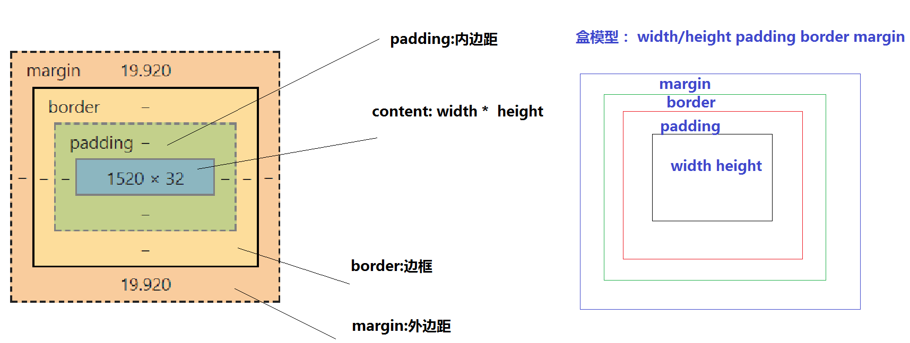

#### 盒子模型


> 取值:
> 1.width  宽度
> 2.height 高度
> 3.padding 内边距
> 4.border 边框
> 5.margin 外边距
> 6.position

> padding 和 margin 的区别
> padding：内边距
> padding 内边距会影响元素在浏览器中的实际大小；最后的实际大小是width/height  + padding属性的值

> margin：外边距
> margin外边距不会影响元素在浏览器中的实际大小;
> 只是和其他的模块产生间距，跟其他模块分离开

> 盒子模型的计算公式:`只有padding和border会影响元素最后在浏览器中显示的实际大小`
> 元素的实际宽度 = width + padding-left/right + border-left/border-right 
> 元素的实际高度 = height + padding-top/padding-bottom + border-top/border-bottom

> margin/padding 取值的情况 
> `遵循顺时针的方向  上 右  下 左 `

> 1.只有一个值的情况: `四个方向取值一样` 
> 缩写的写法:margin:10px;
> 拆分开的写法: 
margin-top:10px;
margin-right:10px;
margin-bottom:10px;
margin-left:10px;


>2.两个值的情况 :  `上下相等   左右相等`
> 缩写的写法：margin:10px 20px; 
>                 =>   margin:10px 20px 10px 20px;
> 拆分开的写法: 
> margin-top:10px;
> margin-right:20px;
> margin-bottom:10px;
> margin-left:20px;

> 3.三个值的情况: `上   左右相等   下 `
> 缩写的写法：margin:10px 20px 30px; 
>                 =>   margin:10px 20px 30px 20px;
> 拆分开的写法: 
> margin-top:10px;
> margin-right:20px;
> margin-bottom:30px;
> margin-left:20px;           
> 
> 4.四个值的情况： ' 上   右  下  左'   顺势针的方向
```


`总结: 以后在实际项目，如果是模块和模块之间的间距就用margin外边距; 如果是模块自己本身的内容间距就用padding内边距`
```
<div class="box1">盒子一</div>
<div class="box2">盒子二</div>
<style type="text/css">
*{
    margin: 0; /*m0 tab*/
    padding: 0; /*p0 tab*/
}
.box1{
    width: 200px; /*w200 tab*/
    height: 50px; /*h50 tab*/
    background: red; /* bg tab*/
    padding:10px;
}
.box2{
    width: 200px; /*w200 tab*/
    height: 50px; /*h50 tab*/
    background: red; /* bg tab*/
    margin:10px;
}
</style>
```


