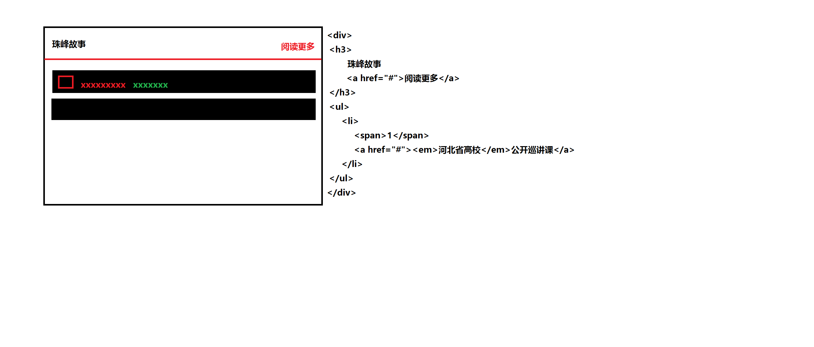
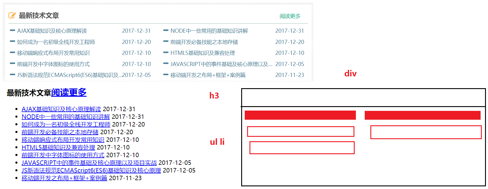

[TOC]
#### 第二天笔记
##### 1.网页的组成部分
> HTML：是一种标记语言
> CSS：层叠样式表
> JS : 是一种脚本语言（B模块详讲）

##### 2.HTML标签
> 1.左右尖括号包起来，里面是标签名，而且标签名一般是小写； `<div></div>`
> 2.一般有开始标签和结束标签组成; 结束标签比开始标签多一个 `/`
> 3.不是所有的标签都有开始和结束，有些标签在开始的地方就自动闭合，这种标签叫单标签/自闭合标签/空标签；``

##### 3.HTML标签属性
>  1.一般是由`属性名 = 属性值`组成；
>  2.如果有多组属性名和属性值，用空格隔开; `属性名 = "属性值"  属性名 = "属性值"` 例如: `<a href="#"  target="_blank"></a>`
>  3.标签属性一般都是放在**开始标签名**的后面；
```
a标签属性:
href="要链接跳转的路径地址"
target="_self" (默认值) 表示在当前窗口打开链接跳转的页面,当前窗口会被覆盖;
target="_blank" 表示在新窗口打开链接跳转的页面,当前窗口不会被覆盖,只是新开了一个窗口而已; 

img标签属性(面试题):

src="图片的路径地址"
alt="图片路径丢失或者出错的情况下出现  他是对图片的文字描述说明内容"
title="鼠标移动图片上的 文字描述说明内容"
```
##### 4.HTML常用的标签
```
p 文字段落标签
div 容器 用来划分块结构 (本身无意义)
h1-h6 标题系列的标签
ul li 无序列表(前面是默认的小黑点)
ol li 有序列表 (前面默认数字 而且数字是依次递增)
dl dt dd 定义列表  
dt(title)定义列表的标题
dd(description)定义列表的描述
strong/b 加粗标签
em/i 斜体标签
a 超文本链接标签
img 插入图片标签
span 划分小块结构或者小图标(无意义)
<br /> 换行符
<hr /> 分割线
```

##### 5.css样式属性
css引入方式之内嵌式
```
语法:
<style type="text/css">
	选择器{
		属性名:属性值;
		属性名:属性值;
		....
	}
</style>
一般放在head头部标签里面,title标签的下面
```

css引入方式之外链式(项目中最常用的方式)
```
<link rel="stylesheet" href="css样式表的路径">
一般放在head头部标签里面,title标签的下面
```


##### 6.常用标签去掉默认的样式属性
```
//=> reset 重置/初始化样式
a 默认的下划线
=>  text-decoration:none 去掉下划线
=>  text-decoration:underline 增加下划线

ul li 默认的小黑点 /ol li 默认的数字
=> list-style:none 去掉li的默认样式

em/i 斜体
=> font-style:normal 斜体变成正常字体

strong/b 加粗
=> font-weight:normal 粗体变成正常
=> font-weight:bold 正常字体加粗

body有默认自带margin:8px (谷歌浏览器)
=> *{margin:0;padding:0;}
* 通配符选择器 代表的是所有的标签
一般放在所有样式的最上面;
```
##### 7.`单行文本`出现省略号必备的四个条件
```
1.宽度  width
2.强制不折行  white-space:nowrap
3.溢出隐藏  overflow:hidden
4.文本隐藏的方式(以省略号的方式隐藏)
text-overflow:ellipsis

//=> 出现省略号的代码片段
width: 800px;
white-space: nowrap;
overflow: hidden;
text-overflow: ellipsis;
```


##### 8.元素的分类
> 1.块级元素：
>  独占一行
>  天生自带属性display:block
>  块级元素可以设置宽高属性;
>  在没有设置宽度和高度的属性的情况下,它的宽度是父元素的宽度，它的高度是本身内容的高度;

> 2.行内元素(内联元素) : 
>  不独占一行
>  天生自带属性display:inline
>  行内元素设置宽度和高度不起作用;如果要宽度和高度起作用需要转换块元素` display:block、display:inline-block`;
>  在没有设置宽度和高度的属性的情况下,它的宽度是本身内容的宽度，高度也是本身内容的高度；

> 3.行内块元素(既有块级元素的特点 又有行内元素的特点)
> 它可以设置宽高
> 不独占一行



