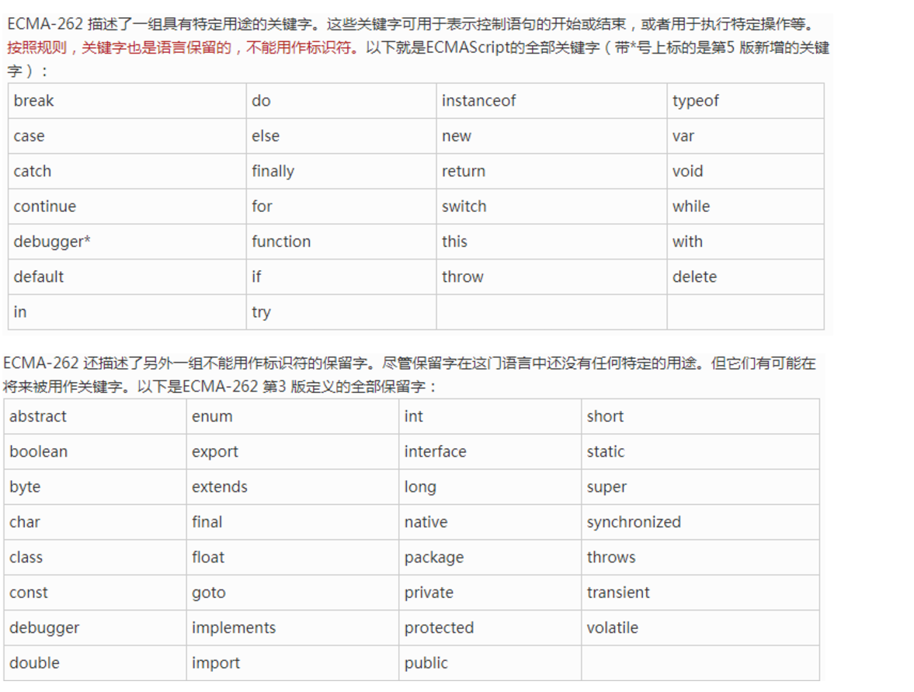
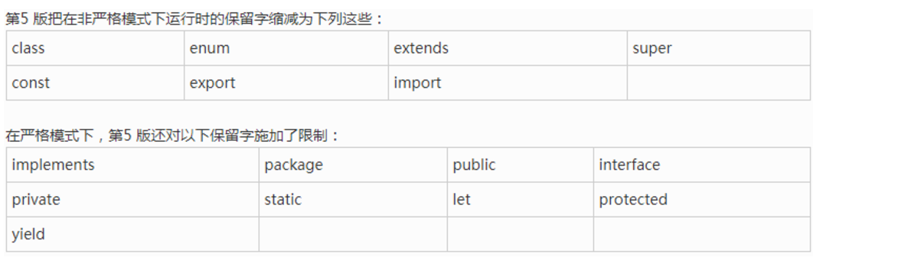

[TOC]
### 1.js免费课第一天

@(2.第一周笔记)

####1、课程介绍
> http://www.zhufengpeixun.cn/main/class/js.html
####2、前端市场发展趋势
`BAT`：百度、阿里、腾讯
`TMD`：今日头条、美团、滴滴
- 1、工程化开发阶段
   >以框架为主的年代：实现模块化开发、快速开发...  [VUE、REACT]
     自动化平台：webpack、gulp、grunt、fis...
     团队开发：git、svn

- 2、移动端开发
>基于hybrid模式的h5混合APP开发
目前APP基本上采用的是安卓(JAVA-NATIVE)和IOS(OBJECT-C)开发
 ReactNative(RN)、ionic、phoneGap...原生JS框架代替传统的APP开发

- 3、全栈开发
 > https://insights.stackoverflow.com/survey/2016
   NODE使用JS开发后台和服务器上的程序

- 4、VR/AR/ webGl

####3、常用的开发工具(IDE) 和笔记工具
- 1、网页三剑客(adobe)
 >`DW(dreamWeaver)`：编写HTML和CSS的
  `PS(photoshop)`：设计图片的(作为前端开发必须会使用：学会切图等功能)
 ` Flash`：使用此工具可以设计制作flash动画

 >UI设计师/美工：设计效果图的;
  前端开发第一职责：把设计师设计好的效果图(PSD格式的)进行切图、量尺寸、测颜色、计算大小等，然后使用HTML+CSS技术把图片制作成为一个HTML静态页面;
sketch:类似于PS，也是设计师设计效果图的工具;

 - 2、sublime text
  >轻量级的开发工具，安装各类插件可以进行代码提示

 - 3、webStorm(建议大家安装最新版本的:WS2016/WS2017/WS11)
 >目前开发者最常用的工具(推荐)，强大的代码提示，包括对于新兴技术(ES6、ES7、REACT、VUE...)都有相关的提示；集成了GIT，方便团队协作；有NODE的提示，可以快速运行NODE程序等...

 - 4、HBuilder
 >类似于WS的开发工具，代码提示也很强大，如果你做的是H5混合APP的开发，可以使用这款工具；HB免费提供在线转换成原生APP的功能；

 - 5、Atom
 >提供可强大的命令窗口，如果你是无鼠标派，喜欢命令操作的感觉，可以使用这款工具(NODE开发)

- 6、笔记工具
>IT编程者写笔记使用的是markdown(xxx.md)
马克飞象就是一款很常用的编写MD技术文档的工具
https://maxiang.io/  在线编辑
还可以下载桌面客户端：安装在自己的电脑上
     
 > 在本地安装马象后，写的技术文档都保存在本地了，如果想远程同步则需要:
1、注册印象笔记账号；
2、在马象中登录印象笔记账号；
3、每年花￥79，可以把自己写的技术文档随时同步到印象笔记中，以后手机随时随地观看自己的笔记；
#### 4、浏览器内核介绍

- 1、谷歌(Chrome)：webkit(v8)，是全世界最快的引擎
safari、欧朋14+、安卓和IOS手机上的浏览器、NODE、webView等都是V8引擎的
- 2、火狐(Firefox)：Gecko
- 3、IE(6/7/8/9/10/11)：Trident，低版本浏览器(IE6~8)
- 4、欧朋(Opera)：Presto
- 5、国产浏览器
    360浏览器(普通版/急速版)、搜狗浏览器、百度浏览器、QQ浏览器、UC浏览器、猎豹浏览器...
    很早以前，国产PC浏览器使用的都是IE的内核，后来手机端兴起，国产手机浏览器都改内核为webkit，再后来为了统一维护PC和移动的浏览器，PC端的也改为webkit内核了
 >`W3C`：万维网联盟，制定标准的非盈利组织，我们写的HTML\CSS\JS等代码的规范都是这个机构制定的；
    开发者：按照规范编写我们的代码；
    浏览器开发商：开发一款浏览器：能够识别开发者编写的代码，然后按照w3c规范，使用电脑的GPU(显卡)在页面中绘制出对应的图像图形等，而识别代码绘制页面就是浏览器的内核（渲染引擎）；
  `-webkit-` 谷歌
 `-moz-` 火狐
`-ms-` IE
 `-o-`    欧朋

> 浏览器兼容： 
1、W3C发布的规范都是开发者们不断尝试总结下来的产物，举个例子：谷歌浏览器开发了一个新的CSS属性（border-radius）可以让开发者快速实现盒子圆角 
-webkit-border-radius 
火狐浏览器发现这个功能很好用，也实现了这个属性 
-moz-border-radius 
… 
W3C把它融入到规范的时候 
border-radius
> 2、每个浏览器为了彰显自己的不一样，不按照标准来，但是把标准中规定的效果用另外一种方式实现了 
window.getComputedStyle 
currentStyle 
我们写的时候写两套

#### 5、JS的组成部分
- `ECMAScript(ES)`：JS的基础语法(变量、数据类型、判断操作语句、循环操作语句等)都是由ES规定的 ES3/ES5 => ES6/ES7
AJAX/JSONP...和服务器端进行数据交互的知识点
- `DOM`：( document object model )文档对象模型，提供一系列的属性和方法让我们能够操作页面中的DOM元素(HTML标签就是DOM元素的一部分)
- `BOM`：( browser object model ) 浏览器对象模型，提供一些属性和方法供我们操作浏览器

####6、css引入方式
```
1.行内式 <div style="属性名:属性值;属性名:属性值"></div>

2.内嵌式(一般放在头部head标签里面的title的下面)
<style type="text/css">
   选择器{
        属性名:属性值;
        属性名:属性值;
        ...
   }
</style>

3.外链式(引入一个外部的css文件)
<link rel="stylesheet" href="引入的外部的css文件的路径">

4.导入式(引入一个外部的css文件)
<style type="text/css">
@import 'CSS的路径'
</style>
```
####7、导入JS的三种方式
- 行内导入JS（不推荐：容易被别人修改脚本然后恶意篡改）
```javascript
<div onclick="alert('zhufeng is nine years old ~~')">点我啊!!</div>
```
- 内嵌导入JS
```javascript
<script>
alert('zhufeng is nine years old ~~');
</script>
```
- 外链式导入JS ( 在script 脚本块中不能再编写其它的JS代码，写了浏览器也不会执行，它只会识别外部JS文件中的代码 )
```javascript
<script src="js/1.js">
    alert('hello world~~');//->这中间的js代码就算写了也不会起作用的
</script>
```
`我们一般会把JS代码写在body中的最底部(写在其它位置也不会报错)`
 >原因 : 因为浏览器加载页面一般都是从上到下加载的，JS一般是用来操作DOM元素的，我们需要先保证DOM加载完成，在JS中才可以获取到这些元素，然后进行相关的操作，所以我们会把JS放在结构的下面再加载；
  放在下面也有一个好处，可以让结构样式先出来再加载JS，减少页面的呈现时间；
  
`需求: 把JS放在上面，也能让结构完成在执行某些JS代码呢？`
 > 使用原生JS中的 `window.onload` 或者
 > jQuery 中的`$(document).ready(function(){}) `就可以实现；
 > jQuery 中采用的是DOM2中的DOMContentLoaded事件完成的 ...
#### 8、JS常用的输出方式
- 1、`alert`：浏览器的提示框，alert([content]) - [content]里面放要提示的内容，提示的内容都是字符串格式的；
```javascript
// 在JS中用双引号和单引号包裹起来的都是字符串
alert('珠峰')
alert("珠峰")  
alert(1) //提示的结果是字符串1(它会把数字转换为字符串)
alert(true) //提示的结果是字符串true
alert([1,2,3]) //提示的结果是字符串1,2,3，不是数组了,它把数组转换为字符串了
alert({name:'珠峰培训',age:9}) // 提示的结果是字符串[object Object],不是之前的对象了,把字符串转换为对象了(toString这个方法转换的)
```
- 2、`confirm`：在alert的基础上增加了确认和取消两个按钮，用户可根据需要选择性操作,选择提示框，和alert 一样提示的结果都是字符串格式的；
```javascript
var flag = confirm('您确定要删除吗?');
// 当用户点击确定按钮的时候，得到的结果是布尔类型的true
// 点击取消或者×，得到的是布尔类型的false
// 这样我们就知道用户进行的是什么样的操作了;
```
 - 3、prompt：在confirm的基础上增加一个输入框，可以让用户输入一些文字(例如：删除的时候除了提示用户是否要删除，而且还想让用户输入删除的原因，就可以使用它了)；
```javascript
var flag = prompt("您确定要删除吗?");
// 如果用户没输入内容获取到的结果是空字符串
// 用户点击取消或者×，得到的结果是null(空)
// 当用户点击确定按钮的时候，我们可以获取到用户输入的内容了;
```
 - 4、浏览器控制台输出
> 优势：想要输出什么格式的数据都可以，不像上述三种方式一样，只能输出字符串;
所有的浏览器按F12( Fn + F12)都可以打开控制台，在谷歌浏览器控制台console选项中可以看到我们输出的结果;
- `console.log([content],[content]...)` :  在控制台console面板输出内容；
- `console.dir`  :  相对于console.log来说输出的内容更加具体的详细；
- `console.table`  :  把json数据变为表格的形式展示出来；

-  5、网页中输出
> - document.write 在文档中打印输出内容
> - innerHTML 在元素中输入内容   可以识别标签名
> - innerText 在元素中输入内容   不识别标签名，而是把标签名当成普通的字符；

####9、JS中的变量和常量
#####1.变量
> 可变的量，在JS中我们使用 `var` 关键词来定义一个变量，而变量存储的值是可以改变的；
>  
> 在JS中变量本身没有什么意义，仅仅是一个名字而已，我们操作变量其实想要操作的都是它存储的那个值；
> 
> 在新版本ECMAScript中(ES6/ES7)，我们可以使用 `let`来定义变量；
```javascript
//->创建了一个叫做aa的变量,并且给变量赋值为1
var aa = 1;
console.log(aa);

aa = 2;
console.log(aa);
```

#####2.常量
> 相对于变量来说，常量是不会改变的，我们可以把JS中的数据值理解为常量，例如：1就是数字1，不可能变为其它的，所以它就是常量 `每一个具体的数据类型值都是常量`
>  
> 如果和变量对比，定义一个常量名字，给它存储一个值，这个值是不能修改的，在新版本ECMAScript中(ES6/ES7)，我们可以使用 `const` 来定义一个常量 

```javascript
const bb = 1;
console.log(bb);

bb = 2;//=>Uncaught TypeError: Assignment to constant variable.
console.log(bb);
```
####10、JS中的命名规范
> 从现在开始做一名有职业操守的IT编程者：养成规范的命名习惯

##### 1.在JS中是严格区分大小写的
```javascript
var test = 12;
var Test = 1;
console.log(test);//=>12 两个变量是不同的,JS严格区分大小写
```
#####2.命名的时候遵循 `驼峰命名法`
> 一个名字如果是由多个有意义单词组成的，那么第一个单词首字母小写，其余每一个有意义单词的首字母都要大写；
```javascript
//=>设置的名字一定要有意义，让别人看到名字大概就了解到变量所代表的含义了
//=>[正确]
var studentInformation;
var studentInfo; //=>Info代表的就是Information

//=>[错误]
var xueshengInfo;
var xsxx;
```
> 行业中常用的一些短词组：
- info：information 信息
- imp：important 重要的
- init：initially 初始化、最初的
- del：delete 删除
- rm：remove 移除
- add：增加
- insert：插入
- create：创建
- fn：function 函数
- update：修改
- select：查询选择
- query：获取
- get：获取
- con：content 内容 、容器
- ...

#####3.可以使用数字、字母、下划线、$来命名，但是数字不能作为名字的开始
```javascript
var studentInfo;
var studentInfo2;
var student_info;
var 3studentInfo; //=>错误的,数字不能开头
var _student; //=>在真实项目中有这样一个约定俗成的规范：以_开头的变量是公共变量(全局变量)，在很多地方都可以获取使用;
var $student; //=>真实项目中如果是通过JQ获取的值，那么存储值的变量我们会在前面以$开始
```
#####4.不能使用关键字和保留字命名
> 关键字：在JS中有特殊含义的，例如：`var`、`for`、`break`、`continue`...
>  
> 保留字：未来可能会成为关键字的，例如：`class`

