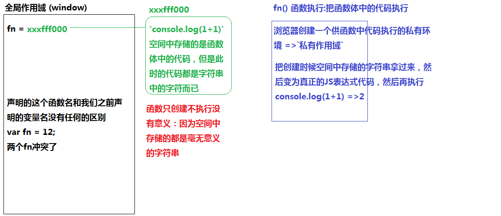
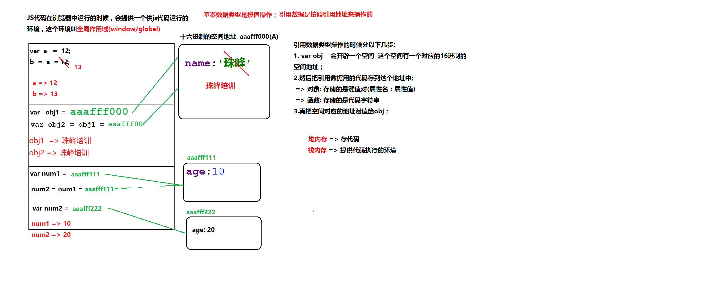

[TOC]
### 2.js免费课第二天
@(2.第一周笔记)
#### 1、数据类型的分类
- 基本数据类型(值类型)
	+ number 数字
	+ string 字符串
	+ boolean 布尔
	+ null
	+ undefined
- 引用数据类型
	+ object 对象数据类型
		+ {} 对象
		+ [] 数组
		+ /^$/ 正则
		+ Math数学函数
		+ Date 的实例
		+ ... 
	+ function 函数数据类型
```javascript
12 -12 -12.5 0  //=>number类型的
'' "" //=>单双引号包起来的都是字符串
true false //=>boolean布尔类型
null //空(没有)
undefined //未定义(没有)
{name:'zxt',age:28} //=>对象
[12,23,34] //=>数组
/^$/ //=>正则
function fn(){}//=>函数
```
#####1.number数据类型的详细解读
> - number有整数 、浮点数值和NaN之分；
> - NaN：not a number 不是一个数，但是属于number类型的；
> - isNaN：这个方法是用来检测当前的值是否不是一个有效数字的，如果检测的值不是有效数字返回true，是有效数字返回false；
```javascript
console.log(isNaN(NaN));//=>true
console.log(isNaN(1));//=>false
console.log(isNaN('1'));//=>false 它是有效数字:当浏览器发现我们检测的值不是number类型的时候,首先会默认的把值转换为number类型,然后再验证是否是有效的数字  '1'->1  isNaN(1)->false
console.log(isNaN('12px'));//=>true  '12px'转换为数字不是有效数字,是NaN
console.log(isNaN(true));//=>首先把布尔类型转换为数字 true ->1 false ->0  最后的结果是isNaN(1)->false
console.log(isNaN(false));//=>false
console.log(isNaN(null));//=>null转换为数字0 =>false
console.log(isNaN(undefined));//=>undefined转换为数字的NaN =>true
```
###### 1.Number() 
>  - 把其它数据类型的值转换为number类型；
>  - Number属于强制类型转换，结果要么是纯数字，否则就是NaN
```javascript
Number(true) //=>1
Number(false) //=>0
Number(null) //=>0
Number(undefined) //=>NaN

//=>使用Number把字符串转换为数字的时候，空字符串是零，其它字符串中如果出现的字符代表纯数字可以转为正常的数字，如果出现了任何一个非有效数字的字符，最后的结果都是NaN
Number('') //=>0
Number('12') //=>12
Number('12.5') //=>12.5
Number('true') //=>NaN
Number('12px') //=>NaN

//=>使用Number把引用数据类型转为数字类型的时候，先把引用类型转换为字符串(toString)，然后再把字符串转为数字
Number({name:'zxt'}) //=> ({name:'zxt'}).toString() =>"[object Object]"  
Number({})  //({}).toString() =>"[object Object]" => NaN
Number([12,23]) //[12,23].toString() => "12,23" =>NaN
Number([12]) //[12].toString() => "12" =>12
Number(['aa']) // =>NaN
Number([]) // =>0
Number(/^$/) //(/^$/).toString() => "/^$/" =>NaN
Number(function(){}) //=>NaN
```
###### 2.parseInt() 转换为整数
>-  也是把其它数据类型转换为数字，整体情况和Number用法一样，
>-  区别在于：在转换字符串的时候，Number是只要出现一个非有效数字字符结果就是NaN；
> - parseInt没有这么霸道，它能把有效的部分识别出来转为数字，非有效的部分直接忽略掉；
> - 查找机制：在查找转换的时候，按照从左到右的顺序依次查找，一直到遇到一个非有效数字字符结束（不管后面是否还有有效数字字符，都不再继续查找），把找到的转换为数字
```javascript
Number('12px')  //=>NaN
parseInt('12px') //=>12
parseInt('12px13') //=>12  
parseInt('px13') //=>NaN
parseInt([12,13]) //=>12
```
###### 3.parseFloat() 
>-  也是把其它数据类型转换为数字；
> - 用法和parseInt一样，区别在于，parseFloat可以识别小数点；
```javascript
parseInt('12.5px') //=>12
parseFloat('12.5px') //=>12.5
parseFloat('12.5.8px') //=>12.5
parseFloat('px12.5') //=>NaN
```
######6.toFixed()
> 控制数字保留小数点后面几位
```javascript
12.5.toFixed() //=>不写参数,相当于不留小数点，会把数字四舍五入到整数上 =>'13'
12.4.toFixed(0) //=>'12'
12.4.toFixed(2) //=>'12.40'
Math.PI.toFixed(2) //=>'3.14'
Math.PI.toFixed(-2) //=>Uncaught RangeError: toFixed() digits argument must be between 0 and 20
```
**思考题：parseInt / parseFloat 都支持第二个参数`parseInt('12px',10)` 获取后自己查找第二个参数的作用！**
#####2.字符串
> 在JS中 单引号 和 双引号 包起来的都是字符串
```javascript
12  //->number
'12' //->string
'[12,23]' //->string

//常用方法
charAt charCodeAt 
substr substring slice 
toUpperCase toLowerCase 
indexOf lastIndexOf 
split 
replace 
match 
…
```
#####3.布尔类型详细解读
> - 只有两个值：true真/false假
- `Boolean()` 把其它数据类型转化为布尔类型，返回的结果为true或者false；
> - 只有`0、NaN、空字符串、null、undefined`五个会转换为false，其余的都会转换为true
```javascript
Boolean(1) //=>true
Boolean(0) //=>false
Boolean(-1) //=>true
Boolean('') //=>false
Boolean('xxx') //=>true
Boolean(null) //=>false
Boolean(undefined) //=>false
Boolean({}) //=>true
Boolean([]) //=>true 
```
> - 取反，把其它数据类型先转换为布尔类型，然后再取反
> `!`：取一次反
> `!!`：取两次反(相当于没有取反，只剩把其它类型的值转换为布尔类型，和Boolean是相同的效果)
```javascript
!null //=> true
!!undefined //=>false
![] //=>false
!![] //=>true
```
##### 4.null和undefined
> - null：空对象指针，但它不是对象类型的，而是基本类型的，表示为空或者没有
> - undefined：未定义，也代表没有；变量只声明未定义返回的结果为undefined；

`0或者空字符串` 和 `null或者undefined` 的区别
> 0或者空字符串：挖了坑没种树
> null或者undefined：连坑都没有挖
>  
> 在JS中null属于没有开辟内存，而空字符串是开辟了内存，里面没有存内容而已，null消耗的性能更低

`null` 和 `undefined` 的区别
> null：意料之中的没有，一般都是当前暂时没有，后期基本上会有
> undefined：意料之外的没有，一般都是当前没有，以后可能有可能没有，但是规划中是不计后面有没有的
>  
> 耿大爷（男）
> 他的女朋友是null
> 他的男朋友是undefined
#####5.对象数据类型的基础知识
```javascript
var obj={
	name:'gengdada',
	age:18,
	sex:'man',
	hobby:['climbing','reading','coding']
};
```
> - 每一个对象数据类型值，都是由一到多组 `属性名` 和 `属性值` 组成的；
> `属性名`：描述当前对象具备的特征  （数字或者字符串格式）
> `属性值`：描述某个特征具体的样子 （任何数据类型都可以）
> - 对象是由零到多组`键(key:属性名)值(value:属性值)对`组成的，每一组之间用逗号分隔；
###### 1、对象的创建
> 字面量创建方式：var obj = {}
> 实例创建方式：var obj = new Object();
```javascript
var obj1 = {name:'gengdada'};//=>不仅可以创建空对象，还可以在创建的时候就增加一些键值对
var obj2 = new Object(); //=>空对象
```
###### 2、对象的操作（增、删、改、查）
```javascript
//=> 对象的增加
var obj = {};
obj.name = 'gengdada';//=>增加一个叫做name的属性,属性值是:'gengdada'
obj['age'] = 18;//=>增加一个叫做age的属性,属性值是:18

//=>对象的修改
//=>修改age对应的属性值：一个对象的属性名是不能重复的(唯一性)，之前没有这个属性，我们的操作是增加操作，之前有这个属性，当前操作就是在修改现有属性名的属性值
obj['age'] = 16;
obj.age = 18;

//=>对象的删除
obj.age = null; //=>假删除：把属性值设置为空，但是属性名是存在的 <=> obj['age'] = null  =>获取age的属性值结果是null
delete obj.age;//=>真删除：把属性名和属性值彻底从对象中移除掉 =>获取age的属性值结果是undefined
console.log(age); //=>获取一个对象某一个属性名对应的属性值，如果当前这个属性在对象中并不存在，获取的结果是undefined

//=>对象的查找
console.log(obj.name);
console.log(obj['name']);
```
###### 3、关于对象操作的总结
> **总结1：**
> - 操作一个对象的属性有两种：
>  + `对象.属性名`：obj.name；
>  + `对象[属性名]`：obj['name']  属性名只能是数字或者字符串，如果是字符串的话，需要加单双引号；
>  
> - 特殊情况：属性名是数字只能使用中括号的方式获取；
>  + var obj={0:'zhufeng'};
>  + obj.0    =>Uncaught SyntaxError: Unexpected number 数字属性名不能使用点的方式处理
> obj[0] / obj['0']  =>使用这种方式是没有问题的，属性名为数字，也就没有必要在加单双引号了
>  
> `思考： obj[age] 和 obj['age'] 的区别?`
> 
> **总结2：**
> - 对象的属性名是唯一的，一个对象的属性名不能重复；
> - 获取某个属性名对应属性值的时候，如果属性存在，获取值即可，如果属性不存在，获取的属性值是undefined；

```javascript
//-> age：变量名，代表的是它存储的值
//-> 'age'：常量，字符串的具体值
var age = 'name';
var obj = {
	name:'zhufeng',
	age:8
};
console.log(obj.age); //=>8
console.log(obj['age']); //=>8
console.log(obj[age]); //=> obj[age变量] =>obj['name'] =>获取name属性名的属性值 =>'zhufeng'
```
#####6.函数数据类型的知识梳理
> 函数数据类型也是按照引用地址来操作的
> 函数：具备一定功能的方法
```javascript
//=>创建函数：相当于生产了一台洗衣机
function 函数名(){
	//=>函数体：实现某一个功能的具体JS代码
}

//=>执行函数：相当于使用洗衣机洗衣服 (如果函数只创建了但是没有去执行，函数没有任何的意义)
函数名();

//=>函数名带括号和不带括号的区别
function fn(){
	console.log(1+1);
}
fn; //=>输出函数本身
fn(); //=>把函数执行（把函数体中实现功能的代码执行）
```


#### 2、数据类型的检测
#####1.typeof ：用来检测数据类型的运算符
> typeof [value] ：返回的是当前[value]的数据类型（`这个类型是一个字符串格式的`），例如："number"、"boolean"、"string"、"object"...
> 
> **局限性：**
- typeof null  结果为"object"  检测null的时候返回的是"object"，但是null是属于基本数据类型的，不是对象数据类型的；
- typeof 不能具体细分是大括号普通对象还是数组或者正则，因为检测这些值返回的结果都是"object"；
```javascript
typeof 12 //=>"number"
typeof NaN //=>"number"
typeof true //=>"boolean"
typeof 'zhufeng' //=>"string"
typeof null //=>"object"
typeof undefined //=>"undefined"

typeof {} //=>"object"
typeof [] //=>"object"
typeof /^$/ //=>"object"
typeof function(){} //=>"function"
```
腾讯面试题：
```javascript
console.log(typeof typeof typeof typeof []);
//typeof [] ->'object'
//typeof 'object' ->'string'
//typeof 'string' ->'string'
//typeof 'string' ->'string'
//=>'string'
```
#####2. instanceof ：用来检测当前某一个实例是否属于这个类的运算符
#####3.constructor ：检测当前实例所属类的构造器的属性
#####4.Object.prototype.toString.call() ：检测数据值所属类的方法

#### 3、基本数据类型和引用数据类型的本质区别(很重要)
> - 当我们把JS代码放在浏览器中运行的时候，浏览器会提供一个供执行代码的环境，我们这个环境叫做`全局作用域(window[前端]/global[后台])`；
>-  JS代码会在全局作用域下自上而下执行；
>

**<font color=red>基本数据类型之所以称之为值类型是因为：基本数据类型的值在进行赋值操作的时候，`是直接按照值来操作的`，例如：var a=12; 它是把12这个值直接的赋值给变量a；</font>**
**<font color=red>引用数据类型`是按照引用地址操作的`，不是按照值操作的；</font>**
```javascript
/*基本数据是对值的操作*/
var a = 12;
b = a; // b = a = 12;
b = 13; //b = 13;
console.log(a); //12
console.log(b); //13

/*引用数据类型操作引用地址*/
var obj1 = {name:'珠峰'};
obj2 = obj1;
obj2.name = '珠峰培训';
console.log(obj1); //珠峰培训
console.log(obj2);//珠峰培训

var num1 = {age:10};
num2 = num1;
var num2 = {age:20};
console.log(num1); //10
console.log(num2); //20
```

> var obj  =  {name:'zhufeng'};
>1.创建一个变量叫做obj；
>2.首先会开辟一个新的存储空间（为了方便后期找到这个空间，给空间设置了一个16进制的地址）
> - 对于对象数据类型来说，存储的是键值对；
> - 对于函数数据类型来说，存储的是代码字符串；
> 
>3.最后在把新开辟空间的地址赋值给当前创建的变量，所以：`变量存储的不是对象具体的值，而是对象开辟的那个新空间的引用地址`


####4、JS判断操作语句
#####1.if 、else if、else
```javascript
//=> 基本语法: 
if(条件1){
	//=>条件1成立执行的操作
}else if(条件2){
	//=>条件1不成立,条件2成立执行的操作
}else if(条件3){
	//=>上面条件不成立，条件3成立执行的操作
}
...
else{
	//=>以上条件都不成立执行的操作
}


//=>&&:并且,所有条件都成立整体才成立
//=>||:或者,只要有一个条件成立整体就成立
var num = 10;
if (num < 5) {
    num++; //=>num+=1  =>num=num+1  在自身基础上累加1
} else if (num >= 5 && num <= 15) {
    num += 2;
} else {
    num--;
}
console.log(num);//=>12


//=>当在判断的操作中,很多条件都是符合的,执行完成第一个符合的条件后,后面的条件不管是否符合都不再处理了
var num = 10;
if (num <= 10) {
    num++;
} else if (num >= 5) {
    num--;
}
console.log(num); //=>11
```
BAT面试题：
```javascript
var num = parseFloat('width:12.5px'); //=>NaN
if(num==12.5){
	alert(12.5);
}else if(num==NaN){//=> NaN!=NaN
	alert(NaN);
}else if(typeof num=='number'){//=> typeof NaN->'number'
	alert(0);//=>'0'
}else{
	alert('啥也不是!');
}
```
#####2.三元运算符
> 语法：条件 ? 条件成立执行 : 条件不成立执行；

 - 1.三元运算符是对if(){}else{}这种简单判断处理的简写，即使不使用三元运算符,if else也能处理；
```javascript

var num = 10;
//=> if else 写法
if (num >= 10) {
    num++;
} else {
    num--;
}

//=> 三元运算符写法
num >= 10 ? num++ : num--;
console.log(num);//=>11
```
- 2.如果条件成立或者不成立的情况下，我们需要处理很多操作，那么需要把处理的事情用 `小括号` 包起来，每一个处理事情之间使用 `逗号` 分隔
```javascript
var num = 10;
//=> if else 写法
if (num >= 10) {
	num++;
	num = num * 10;
} else {
	num--;
	num = num / 10;
}

//=> 三元运算符写法
num >= 10 ? (num++, num = num * 10) : (num--, num = num / 10);
console.log(num);//=>110
```
- 3.如果条件成立或者不成立的情况下，我们不需要做任何事情，可以在三元运算符中使用null或者void 0(undefined)来占位即可
```javascript
var num = 10;
//=> if else 写法
if (num == 10) {
     num++;
}
//=> 三元运算符写法
//num==10?num++:; //=>Uncaught SyntaxError: Unexpected token ;
num == 10 ? num++ : null;
num == 10 ? num++ : void 0;
```
- 4.对于复杂的一些判断操作，使用 if else会更加的清晰明了，此时慎用三元运算符
```javascript
var num = 10;
//num >= 0 ? (num <= 10 ? num++ : num--) : (num <= -10 ? num++ : num--);

//->改写成 if else
if (num >= 0) {
    if (num <= 10) {
        num++
    } else {
        num--;
    }
} else {
    if (num <= -10) {
        num++;
    } else {
        num--;
    }
}
```
#####3.switch case
```javascript
//=> 基本语法: 
switch(变量或者值){
	case [value1]: //如果switch中的变量或者值和当前case后面的值相等，则执行这些操作;
		break; //每一种case情况结束都需要加break，达到条件成立处理完成，跳出当前判断
	...
	default: //以上值都不满足，执行这里的操作，最后一个就不需要加break	
}


//=> if else 写法: 
var num = 10;
if (num == 0) {
    num++;
} else if (num == 5) {
    num--;
} else if (num == 10) {
     num = num * num;
} else {
    num = 0;
}

//=> switch case 写法: 
switch (num) {
    case 0:
        num++;
        break;
    case 5:
        num--;
        break;
    case 10:
        num *= num;
        break;
    default:
        num = 0;
}
console.log(num); //100
```
- 在switch case中我们可以利用case后面不加break的特点（不管后面条件是否成立都会继续执行，直到遇到break为止），实现当变量等于某几个值的时候，我们做相同的事情
```javascript
var num = 5;
switch (num) {
    case 0:
        num++;
        break;
    case 5:
    case 10:
        num *= num; //=>只要当前的num等于5或者等10都去做同样的事情
        break;
    default:
        num = 0;
}
console.log(num);
```
- 每一种case情况的比较都是使用`===`进行比较的：绝对相等
####5.JS中常见的符号
#####1、等号的三种情况
> `=`：赋值，变量`=`值
> `==`：比较，值`==`值
> `===`：绝对比较，要求值相等而且数据类型也要相等
> 
> - 如果左右两边比较的值是相同类型的，那么直接比较内容是否一样即可；
> - 如果两边值的类型不一样，`==`和`===`是有区别的：
> `===`类型不一样，最后的结果就是false，更加的严谨
> `==`类型不一样，浏览器首先会默认的把类型转化为一样的，然后再比较内容，相对松散一些
```javascript
'10'==10   //=> true 浏览器会把'10'->10然后再比较
'10'===10  //=> 数据类型不相等直接为 false
```
#####2、数学运算中的符号" 加+ 、减- 、乘* 、除/ "
> 在JS中`* / -`都是数学运算，遇到非数字操作，浏览器也会转换为数字进行操作；
> 但是`+`不一定是数学运算，如果遇到了字符串，属于字符串的拼接

```javascript
'10'*10 //=>100  浏览器会把字符串转为数字然后再运算（数学）
'10'/10 //=>1
'10'-10 //=>0
'10'+10 //=>'1010'  字符串拼接
```


