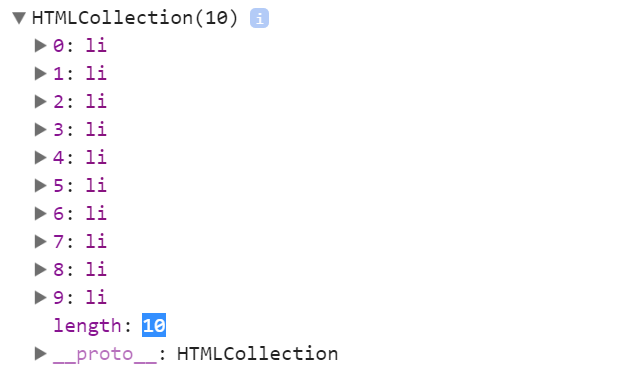

[TOC]
### 3.js免费课第三天

@(2.第一周笔记)

####1.JS中的循环语句
> 重复做相同的事情就是循环：在真实项目中只要我们想重复做一件事件就要用到循环
> - for循环
> - for in 循环
> - while循环
> - do while循环
> - ...
#####1、for循环
```javascript
//=> js中for循环的语法
for(设置初始值;设置循环执行的条件;步长累加){
	//->条件成立，执行循环体中的内容(循环体中存放的就是我们需要重复处理的事情)
}
第一步：设置初始值
第二步：验证(设置)循环能够执行的条件
第三步：条件成立，执行循环体中的内容，不成立直接结束循环
第四步：每一次执行完成循环体中内容，为了能够执行下一次的循环，做一下步长的累加


//=> 案列分析
for(var i=0;i<5;){
	console.log(i);
}
//=>上述代码是死循环:i永远是0，条件永远成立，循环会一直执行下去


for(var i=0;i<5;i++){
	console.log(i);//-> 0 1 2 3 4
}
console.log(i);//->循环结束执行这个操作 =>5


for(var i=0;i<5;i+=3){
	console.log(i);//=> 0 3
}
console.log(i);//=> 6


for(var i=1;i<=5;i+=2){
	i<3?i++:i--;
	console.log(i);//=>2 3 4
}
console.log(i);//=>6
```
#####2、continue 和 break
> `continue`：结束当前本轮循环，继续执行下一轮循环
> `break`：结束整个循环
> 
> 所谓结束本轮循环：其实就是让循环体中continue后面的代码不再执行，直接的去进行步长累加，开启下一轮的循环
> 所谓结束整个循环：其实就是当循环体中遇到break，break后面的操作语句都不再执行，步长累加也不再执行，所有和循环有关的都结束了
```javascript
//=> 案列解析
for(var i=0;i<5;i++){
	continue;
	i+=2;
}
console.log(i); //=>5


for(var i=0;i<5;i++){
	break;
	i+=2;
}
console.log(i); //=>0

//=> 腾讯面试题
for(var i=0;i<10;i+=2){
	if(i<=5){
		i++;
		continue;
	}else{
		i--;
		break;
	}
	console.log(i); 
}
console.log(i); //=>5
```
#####3、for in 循环
> - 用来遍历(循环)对象键值对；
> - 一般对象中有多少组键值对,我们的for in循环就遍历多少次；
> - 一次循环key这个变量存储的都是当前循环这组键值对的属性名；
> 1、key存储的值都是字符串格式的(不管属性名是否为数字)；
   2、在for in循环遍历的时候，大部分浏览器都是先把对象中的键值对进行排序（把数字属性名的排在前面，并且排列的时候按照数字由小到大排列），其次在把非数字的属性名按照之前编写的顺序排列，循环的时候按照重新排列的顺序依次遍历 （小数算作字母不算做数字）；
```javascript
var obj = {name: '珠峰培训', age: 8, 1: '耿大大', 3: '张大大', 2: '周大大', 2: '哈哈'};
for (var key in obj) {
	console.log(typeof key);  //=>"string"
	console.log(obj.key); //=>字符串key,获取obj中key这个属性对应的属性值 =>undefined  <=>  obj['key']
	console.log(obj[key]); //=>变量key,获取的是key变量存储的值
}
```
`for循环快捷键: for循环 itar tab; for in 循环 itin`
#### 2.JS中一些常用的操作DOM的属性和方法
#####1、document.getElementById()
> 在整个文档中，通过元素ID来获取一个元素
>  
> 在这里我们把document称之为上下文(context)：上文和下文，也就是获取元素时候限制的那个范围

```javascript
var oTab = document.getElementById('tab');
//=>获取的结果是一个对象数据类型的值：在JS中使用DOM提供的方法，获取的元素都是对象，所以我们把获取的结果称之为 ‘元素对象’

//=>元素对象天生具备很多内置的属性（浏览器在渲染页面的时候就给当前元素设置了）
oTab.className= '' //=>通过这个属性可以获取或者设置当前元素对象的样式类`<ul class='xxx'></ul>`
oTab.className+=' tab1' //=>在原有的样式类基础上在增加一个样式类（样式类之间用空格隔开）
oTab.className='tab1' //=>把原有的样式类名替换为新的样式类

oTab.innerHTML：通过这个属性可以获取或者设置元素里面的内容
oTab.innerText：等同于上面的innerHTML
//=>两者的区别：
//=>innerHTML可以把增加内容(字符串)中的HTML标签进行识别
//=>innerText不管是否为标签，都按照普通的文本处理

oTab.style; //=> 通过这个属性我们可以获取或者设置元素的样式（但是只能操作元素的行内样式，写在内嵌或者外链中的CSS样式无法通过这个属性操作）
//=><ul style='...'></ul>
//=>window.getComputedStyle([元素],[伪类]) || [元素].currentStyle 获取当前元素所有经过浏览器计算的样式(不管写在哪,也不管写不写)

//=>除了以上一些常用的内置属性，我们很多时候会给元素对象设置一些自定义的属性
oTab.myAttribute = xxx;
oTab['myAttribute'] = xxx;
```

#####2、[context].getElementsByTagName()
> 在指定上下文[context]中，通过元素的标签名来获取一组元素
```javascript
var oLis = oTab.getElementsByTagName('li'); //=>获取的结果也是一个对象数据类型的值

//1、以数字作为属性名，每一个属性存储的都是获取到的每一个li，JS中我们把数字属性名叫做'索引'（索引是逐级递增的）
oLis[0] 获取第一个LI
oLis[1] 获取第二个LI
oLis[n] 获取第N+1个LI

//2、有一个length属性存储的是当前集合中LI的个数
oLis.length
//=>具备以上的两个特点特别像数组，但是不是数组，所以我们把他称之为'类数组'
```

#### 3.思考练习题:
```javascript
var num = 'abc123';
    num = parseInt(num); 
    if (num == 123) {
        alert(123);
    } else if (num == NaN) { 
        alert(NaN);
    } else if (typeof num == 'number') {
        alert('number');  //=> 'number'
    } else {
        alert('str');
}


//京东面试题:
 for(var i=0;i<10;i++){
     alert(i); // => 0
     break;
 }
 alert(i); // => 0

 for(var i=0;i<10;i++){
     continue;
     alert(i);   // => continue和break后面的代码都不执行
 }
 alert(i); //=> 10

//=> 作业思考题:
typeof isNaN("1px");
typeof parseInt(null);
isNaN(parseInt(typeof NaN));
!parseInt(null) + !!isNaN(0) + Number([])
!parseInt(null)
!!isNaN(0)
Number([])
true + false +0
typeof 1
console.log(typeof !parseInt(null) + !!isNaN(0) + Number([]));
console.log(!!typeof Number(undefined));
console.log(isNaN(null) + typeof typeof Number([]));
console.log(!typeof parseFloat("0"));

var age = 'name';
var obj = {
    name:'耿大大',
    age:18
};
console.log(obj.age);
console.log(obj['age']);
console.log(obj[age]);

//思考题二:
var sex = 'man';
var obj = {
    man: '耿大大',
    sex: 'man',
    0: 1
};
console.log(obj.sex);
console.log(obj[0]);
obj.sex = 'woman';
console.log(obj['sex']);
console.log(obj[sex]);

//思考题三:
console.log(typeof typeof typeof []);

//思考题四:
var result = 10 + null + [] + undefined + 'zhufeng' + null + [] + undefined;
console.log(result);

//思考题五:
var result1 = 10 + false + true + null + undefined + null + 'zhufeng' + null + true + undefined;
console.log(result1);
```		
#### 4. 综合实战案例: 隔行变色


#####1.css方法实现隔行变色效果
```
<style type="text/css">
	*{
	    margin: 0;
	    padding:0;
	}
	li{
	    list-style:none;
	}
	#list{
	    width: 500px;
	    margin:0 auto;
	}
	#list li{
	    height: 30px; 
	    line-height: 30px;
	    cursor: pointer; 
	}
	#list li:nth-child(2n+1){
	    background: gold; 
	}
	#list li:nth-child(2n){
	    background: yellow;
	}
	#list li:hover{
	    background: darkcyan;
	}
</style>
<ul id="list">
    <li>习近平2017达沃斯日内瓦主旨演讲的世界意义</li>
    <li>习近平贺信引发拉美各界人士热烈共鸣</li>
    <li>党中央国务院决定了 在全国开展扫黑除恶专项斗争</li>
    <li>为中国特色社会主义发展提供宪法保障 理上网来</li>
    <li>宪法修改必须依法按程序进行 新时代新气象新作为</li>
    <li>习近平2017达沃斯日内瓦主旨演讲的世界意义</li>
    <li>习近平贺信引发拉美各界人士热烈共鸣</li>
    <li>党中央国务院决定了 在全国开展扫黑除恶专项斗争</li>
    <li>为中国特色社会主义发展提供宪法保障 理上网来</li>
    <li>宪法修改必须依法按程序进行 新时代新气象新作为</li>
</ul>
```
##### 2.js方法实现隔行变色效果
```javascript
<style type="text/css">
    *{
        margin: 0; 
        padding:0;
    }
    li{
        list-style:none;
    }
    #list{
        width: 500px;
        margin:0 auto;
    }
    #list li{
        height: 30px; /*h50 tab*/
        line-height: 30px;
        cursor: pointer;
    }
</style>
<ul id="list">
    <li>习近平2017达沃斯日内瓦主旨演讲的世界意义</li>
    <li>习近平贺信引发拉美各界人士热烈共鸣</li>
    <li>党中央国务院决定了 在全国开展扫黑除恶专项斗争</li>
    <li>为中国特色社会主义发展提供宪法保障 理上网来</li>
    <li>宪法修改必须依法按程序进行 新时代新气象新作为</li>
    <li>习近平2017达沃斯日内瓦主旨演讲的世界意义</li>
    <li>习近平贺信引发拉美各界人士热烈共鸣</li>
    <li>党中央国务院决定了 在全国开展扫黑除恶专项斗争</li>
    <li>为中国特色社会主义发展提供宪法保障 理上网来</li>
    <li>宪法修改必须依法按程序进行 新时代新气象新作为</li>
</ul>
<script type="text/javascript">
//=> 写法一:通过style实现样式
var oList = document.getElementById('list'),
        oLis = oList.getElementsByTagName('li');
for (var i = 0; i < oLis.length; i++) {
       if(i%2 == 0){
           //奇数行
           oLis[i].style.backgroundColor = 'greenyellow';
       }else if(i %2 ==1){
           //偶数行
           oLis[i].style.backgroundColor = 'yellow'
       }
    }


//=> 写法二:通过className实现样式
var oList = document.getElementById('list'),
    oLis = oList.getElementsByTagName('li');
    for (var i = 0; i < oLis.length; i++) {
       if(i%2 == 0){
           oLis[i].limeng = oLis[i].className = 'bg1'
       }else if(i %2 ==1){
           oLis[i].limeng = oLis[i].className = 'bg2';
       }
      
       //=>或者用三元运算符:oLis[i].limeng = oLis[i].className = (i%2 == 0) ? 'bg1' : 'bg2';
       oLis[i].onmouseover = function () {
            this.className = 'bg3'
        };
        oLis[i].onmouseout = function () {
            this.className =  this.limeng
        }
    }   
    
</script>        
```

#### 5. 综合实战案例: 选项卡切换效果

```javascript
// => 选项卡效果实现的思路
//1.要操作谁先获取谁 -> tab li div
 //2.循环遍历每一个li   -> for 循环
 //3.在上面的for循环里面进行一些操作 (第三步 是套在 第二步中执行的)
   // 1) 清空所有cur的样式类名 ->for
   // 2) 让当前添加cur的样式类名

<script type="text/javascript">
var oTab = document.getElementById('tab'),
    oLis = oTab.getElementsByTagName('li'),
    oDivs = oTab.getElementsByTagName('div');
for (var i = 0; i < oLis.length; i++) {
    oLis[i].dali = i;
    oLis[i].onmouseover = function () {

        for (var j = 0; j < oLis.length; j++) {
            oLis[j].className = null;
            oDivs[j].className = null;
        }

        this.className = 'cur';
        oDivs[this.dali].className = 'cur';
    }
}
</script>
```			

#### 6.函数专题
> - 函数是由事件驱动的或者当它被调用时执行的可重复使用的代码块；
> - 函数是实现某一个功能的方法；
#####1、函数的基础操作
######1.函数的语法
```javascript
//=> 函数就是包裹在花括号中的代码块，前面使用了关键词 function
function  函数名(){
	//=> 这里是要执行的代码
}
```
######2.创建函数
```javascript
function 函数名(){
	//=>[函数体]
	//实现功能的具体JS代码
}
```
######3.执行函数
```javascript
//=>把创建的函数执行，而且这个函数可以执行很多次
//=>每一次执行都相当于把函数体中实现功能的JS代码重复执行了一遍
函数名(); 
函数名();
...
```
> 在真实项目中，我们一般都会把实现一个具体功能的代码封装在函数中：
> 1、如果当前这个功能需要在页面中执行多次，不封装成为函数，每一次想实现这个功能，都需要重新把代码写一遍，浪费时间；而封装在一个函数中，以后想实现多次这个功能，我们就没有必要在重新写代码了，只需要把函数重新的执行即可，提高了开发效率；
> 2、封装在一个函数中，页面中就基本上很难出现重复一样的代码了，减少了页面中代码的冗余度，提高了代码的重复利用率：`低耦合高内聚`
> 
> 我们把以上的特点称为**`函数封装`**（OOP面向对象编程思想，需要我们掌握的就是类的继承、封装、多态）
#####2、函数的核心操作原理
> - 函数作为JS中引用数据类型中的一种，也是按照引用地址来操作的；
```javascript
var obj={
	name:'珠峰培训',
	age:9
};
function sum() {
    var total = 1 + 1;
    total *= 20;
    console.log(total.toFixed(2));
}
sum();
```
######1.创建函数
- 首先会在当前作用域中声明一个函数名(声明的函数名和使用var声明的变量名是一样的操作：var sum;  function sum; 这两个名字算重复了)
- 浏览器首先会开辟一个新的内存空间(分配一个16进制地址)，把函数体中写好的代码当做普通字符串存储在这个内存空间中(创建一个函数如果不执行,函数没有意义)
- 把内存空间的地址赋值给之前声明的那个函数名

######2.函数执行
> 目的：把之前存储的实现具体功能的JS代码执行
- 函数执行，浏览器首先会为其开辟一个新的`私有作用域`(只能执行函数中之前编写的JS代码)
- 形参赋值 (先跳过)
- 私有作用域中的变量提升 (先跳过)
- 把之前创建时候存储的那些JS代码字符串，拿到私有作用域中，然后把它们变为JS表达式从上到下执行
- 私有作用域是否销毁的问题 (先跳过)
######3.闭包
> 函数执行会形成一个私有的作用域，让里面的私有变量和外界互不影响（相互不干扰、外面的无法直接获取里面的变量值），此时我们可以理解为私有作用域把私有变量保护起来的，我们把这种保护机制称之为**`闭包`**;
######4.栈内存
> 作用域（全局作用域/私有作用域）：提供一个供JS代码执行的环境
######5.堆内存
> 所有的引用数据类型，它们需要存储的内容都在堆内存中（相当于一个仓库，目的是存储信息）
> - 对象会把键值对存储进来
> - 函数会把代码当做字符串存储进来
#####3、函数的形参和实参
> 形参：相当于生产洗衣机的时候提供的入口，需要用户执行函数的时候把需要的值传递进来，形参是个变量，用来存储和接收这些值；
> 实参：用户执行的时候传递给形参的具体值；
```javascript
//=>随便求出两个数的和
function sum(num1,num2){//=>num1/num2就是形参
	var total = num1+num2;
	total*=10;
	total=total.toFixed(2);
	console.log(total);
}
sum(10,20);//->10/20是实参 num1=10 num2=20
sum(10); //->num1=10 num2=undefined 定义了形参但是执行的时候没有传递实参，默认实参的值是undefined


function sum(num1, num2) {
    //=>如果有一个值没有传递的话,我们为了保证结果不是NaN,我们为其设置一个默认的值:0
    // if (num1 === undefined) { num1 = 0; }
    // if (typeof num2 === "undefined") { num2 = 0; }
    // typeof num1 === "undefined" ? num1 = 0 : null;
    // typeof num2 === "undefined" ? num2 = 0 : null;
    //=>容错处理
    num1 = num1 || 0;
    num2 = num2 || 0;
    var total = num1 + num2;
    total *= 10;
    total = total.toFixed(2);
    console.log(total);
}
sum(10, 20);
```
#####4、函数中的arguments
> 当我们不知道用户具体要传递几个值的时候（传递几个值都行），此时我们无法设置形参的个数；遇到此类需求，需要使用函数内置的实参集合：arguments
> - 1、arguments只有函数才有；
> - 2、不管执行函数的时候是否传递实参，arguments天生就存在，没有传递实参arguments是个空的集合，传递了arguments中包含了所有传递的实参值 ；
> - 3、不管是否设置了形参，arguments中始终存储了所有的实参信息；
```javascript
function sum() {
	console.log(arguments.callee.caller);//=>fn
}
function fn() {
    sum(10, 20, '珠峰', {name: '珠峰'});
}
fn();
```

> arguments是一个类数组集合
>- 1、以数字作为索引(属性名)，从零开始
> arguments[0] 第一个实参信息
> arguments[2] 第三个实参信息
> arguments[n] 第n+1个实参信息
>- 2、有一个length的属性，存储的是当前几个的长度（当前传递实参的个数）
> arguments.length
> arguments['length']
> - 3.arguments.callee：存储的是当前函数本身;
> - 4.arguments.callee.caller：存储的是当前函数在哪执行的（宿主函数），在全局作用域下执行的，结果是null; 

`arguments.callee或者arguments.callee.caller一般真正项目中很少使用：因为在严格的JS模式下不允许我们使用这两个属性，然而现有项目大部分都是基于严格模式来的`
```javascript
"use strict"; //=>开启JS的严格模式
function sum() {
    console.log(arguments.callee);//=>Uncaught TypeError: 'caller', 'callee', and 'arguments' properties may not be accessed on strict mode functions or the arguments objects for calls to them
}
sum(10, 20, '珠峰', {name: '珠峰'});
```
**实战案列：任意数求和**
```javascript
function sum() {
    var total = null;
    for (var i = 0; i < arguments.length; i++) {
        var cur = Number(arguments[i]);
        !isNaN(cur) ? total += cur : null;
    }
    console.log(total);
}
sum(10, 20, 30);
sum();
sum(10, 20, '30');
sum(10, 20, 30, '珠峰');
```
#####5、函数中的return
> 返回值是函数提供的一个出口：我们如果想在外面使用函数私有的一些信息，那么就需要通过return，把这些信息返回出来供外面使用；
```javascript
function sum() {
    var total = null;
    ...
    return total;//=>return后面跟着的都是值（返回的都是值）：此处不是把total变量返回，而是把total存储的值返回而已 <=> return 60;
}
console.log(sum(10, 20, 30));
//=>sum:代表的是函数本身
//=>sum():让函数先执行,代表的是当前函数返回的结果(return后面是啥,相当于函数返回的是啥)


//=>如果函数中没有写return或者return后面啥也没有,默认返回的结果就是undefined
function sum() {
    var total = 0;
    return;
}
console.log(sum());


//=>在函数体中遇到return后,return后面的代码都不再执行了
function sum() {
    var total = 0;
    return;
    console.log(total);
}
console.log(sum());
```
**实战案列：任意数求和完整版**
```javascript
function sum() {
    var total = null;
    for (var i = 0; i < arguments.length; i++) {
        var cur = Number(arguments[i]);
        !isNaN(cur) ? total += cur : null;
    }
    return total;
}
var total = sum(10, 20, 30);//=>外面是全局下的total 和函数中的total没有必然的联系
console.log(total.toFixed(2));
```
#####6、匿名函数
> 匿名函数就是没有名字的函数； `函数表达式` 和 `自执行函数`
```javascript
//=>把一个没有名字的函数(有名字也无所谓)作为值赋值给一个变量或者一个元素的某个事件等:·函数表达式·
oBox.onclick = function(){}

//=>创建函数和执行函数放在一起了，创建完成立马执行：·自执行函数·
;(function(n){})(10);

//=>以下都是自执行函数，符号只是控制语法规范
~function(n){}(10);
-function(n){}(10);
+function(n){}(10);
!function(n){}(10);
```