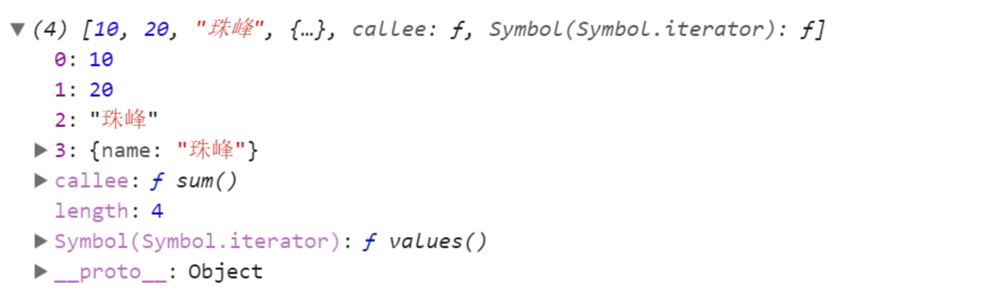

[TOC]
### 4.js免费课周末笔记

@(2.第一周笔记)

####1.数据类型转换(汇总)
#####1.把其它数据类型转换为number类型
> isNaN、Number、parseInt、parseFloat
> 在进行加减乘除数学运算的时候
```javascript
true //=>1    
false //=>0
''//=>0   
'12' //=>12   
'12px'//=>NaN/12  
'珠峰' //=>NaN
null //=>0
undefined //=>NaN

//=>引用数据类型转换为数字,通过toString方法把数组转化为字符串，然后再调用Number把字符串转换为数字
{} //=>NaN
/^$/ //=>NaN
function(){} //=>NaN
[] //=>''=> 0
[12] //=>'12' ->12
[12,23] //=>'12,23' ->NaN
```

#####2.JS中的数学运算
> +、-、*、/  加减乘除
> 除了加法有特殊性，其余的运算符都是数学运算，也就是遇到非数字类型，需要把其转换为number再进行运算；
>  
> `加法的的特殊性`： 在遇到字符串的时候，+不是数学运算，而是字符串拼接，只要不遇到字符串就是数学运算；
```javascript
//=>字符串拼接：是把其它的值转换为字符串然后再拼接(toString)
//=>其它数据类型的toString是直接的把值用单(双)引号包起来即可，只有对象的有特殊性，对象.toString() === '[object Object]'
1-'1' //=>0
10*null //=>0
10/undefined //=>NaN
10*[10] //=>100
1+'1' //=>'11'
null+'1' //=>'null1'

分析思路:
1+null+true+undefined+[]+'珠峰'+null+undefined+[]+10 
//=>1+null ->1
//=>1+true ->2
//=>2+undefined ->NaN
//=>NaN+[] ->NaN+'' ->'NaN'
//=>'NaN'+'珠峰' ->'NaN珠峰'
//=>'NaN珠峰nullundefined10'
```

#####3.将其它数据类型转换为布尔类型
> Boolean、!、!!
> 在条件判断的时候，也是转换为布尔类型，然后验证条件的真假
>  
> 只有`0、NaN、空字符串、null、undefined`五个转换为false，其余的都是转换为true

```javascript
if(box){
	//=>首先把box变量存储的值获取到，转化为布尔类型，如果为true条件成立，反之不成立
}

if(3+'3px'){
	//=>条件成立：3+'3px'='33px'
}
if(3-'3px'){
	//=>条件不成立：3-'3px'=NaN
}
```

#####4.在使用==进行比较的时候
> 在使用==进行比较的时候，如果左右两边数据类型不相同，浏览器会默认转换为相同的类型，然后再比较（`===`不会这样操作）

```javascript
//=>对象和对象：比较的是空间地址，不是相同的空间，结果肯定是false
[]==[]  //=>false  
var a={};
var b=a;
a==b  //=>true

//=>对象和数字：把对象转换为数字
[]==0  //=>true
({})==NaN  //=>false  NaN和自己不相等和其它任何值都不相等

//=>对象和字符串: 对象先转字符串，然后进行比较
[]==''  //=>true

//=>对象和布尔：把两边都转换数字
[]==true  //=>0==1 ->false
[]==false  //=>0==0 ->true
![]==false  //=>![] 把数组变为布尔在取反=false  ->false==false ->true

//=>字符串和数字：字符串转换为数字
//=>字符串和布尔：都转为数字
//=>布尔和数字：布尔转换为数字

//=>规律：两个等于号比较，左右两边数据值的类型不一样，浏览器会把两边的类型都转换为数字然后再比较，但是null和undefined除外
null==undefined  //=>true
null===undefined  //=>false
null==0   //=>false  null以及undefined和其它任何值都不相等
```
#### 2.经典面试题解读
```javascript
typeof isNaN("1px");
typeof parseInt(null);
isNaN(parseInt(typeof NaN));
!parseInt(null) + !!isNaN(0) + Number([])
!parseInt(null)
!!isNaN(0)
Number([])
true + false +0
typeof 1
console.log(typeof !parseInt(null) + !!isNaN(0) + Number([]));
console.log(!!typeof Number(undefined));
console.log(isNaN(null) + typeof typeof Number([]));
console.log(!typeof parseFloat("0"));


//思考题一:
var age = 'name';
var obj = {
    name:'耿大大',
    age:18
};
console.log(obj.age);
console.log(obj['age']);
console.log(obj[age]);

//思考题二:
var sex = 'man';
var obj = {
    man: '耿大大',
    sex: 'man',
    0: 1
};
console.log(obj.sex);
console.log(obj[0]);
obj.sex = 'woman';
console.log(obj['sex']);
console.log(obj[sex]);

//思考题三:
console.log(typeof typeof typeof []);

//思考题四:
var result = 10 + null + [] + undefined + 'zhufeng' + null + [] + undefined;
console.log(result);

//思考题五:
var result1 = 10 + false + true + null + undefined + null + 'zhufeng' + null + true + undefined;
console.log(result1);

//思考题六:
for(var i=1;i<10;i+=2){
    if(i<5){
        i++;
        continue;
    }else{
        i+=3;
        break;
    }
    console.log(i);
}
console.log(i);

//思考题七:
var str = 'abc123';
var num = parseInt(str);
if(num==NaN){
    alert(NaN);
}else if(typeof num == 'number'){
    alert('number');
}else{
    alert('str');
}

//思考题八:
for(var i=0;i<10;i++){
    if(i<=4){
        i++;
        continue;
    }else{
        i--;
        break;
    }
    console.log(i);
}
console.log(i);
```
####3.项目实战:  隔行变色最终的代码
```javascript
// 1.隔三行变色
// 2.鼠标移上变色
// 3.鼠标移出回到原本的颜色
// 4.鼠标点击弹出我是几个li
<style type="text/css">
   * {
       margin: 0; 
       padding: 0; 
   }

   li {
       height: 40px;
       line-height: 40px;
       cursor: pointer;
   }

   .bg1 {
       background: red;
   }

   .bg2 {
       background: blue;
   }

   .bg3 {
       background: yellow;
   }

   .bg4 {
       background: beige;
   }
</style>
<ul>
    <li>01:课程介绍</li>
    <li>02:前端市场发展趋势</li>
    <li>03:常用的开发工具</li>
    <li>04:浏览器内核介绍</li>
    <li>05:导入JS的三种方式</li>
    <li>06:JS常用的输出方式</li>
    <li>07:学会使用控制台</li>
    <li>08:JS中的变量和常量</li>
    <li>09:JS中的命名规范</li>
    <li>10:数据类型分类和检测</li>
</ul>
<script type="text/javascript">
    var oLis = document.getElementsByTagName('li');
    for (var i = 0; i < oLis.length; i++) {
        oLis[i].index = i;
        oLis[i].bg = oLis[i].className = 'bg' + (i % 3 + 1);
        oLis[i].onmouseover = function () {
            this.className = 'bg4';
        };
        oLis[i].onmouseout = function () {
            this.className = this.bg;
        };
        oLis[i].onclick = function () {
            alert('这是第' + (this.index + 1) + '个li');
        }
    }
</script>
```
#### 4.项目实战: 选项卡切换
```
<style type="text/css">
  *{
      margin: 0;
      padding: 0;
  }
  #tab{
      width: 306px;
      margin:50px auto;
  }
  #tab ul{
      overflow: hidden;
  }
  #tab li{
      float: left;
      width: 100px;
      height: 30px;
      line-height:30px;
      text-align: center;
      border:1px solid #000;
      list-style: none;
  }
  #tab .cur{
      background: red;
  }
  #tab div{
      display: none;
      height: 100px;
      line-height: 100px;
      text-align: center;
      border:1px solid #000;
      border-top:0;
  }
  #tab .cur{
      display: block;
  }
</style>
<div id="tab">
    <ul>
        <li class="cur">新闻</li>
        <li>娱乐</li>
        <li>健康</li>
    </ul>
    <div class="cur">新闻</div>
    <div>娱乐</div>
    <div>健康</div>
</div>
<script type="text/javascript">
// 利用自定义属性的方法
var oTab = document.getElementById('tab'),
    oLis = oTab.getElementsByTagName('li'),
    oDivs = oTab.getElementsByTagName('div');
for (var  i = 0; i < oLis.length; i++) {
    var previousIndex =  0;
    oLis[i].index = i;
    oLis[i].onclick = function () {
        if(previousIndex  == this.index){
            return;
        }
        
        oLis[previousIndex].className = null;
        oDivs[previousIndex].className = null;

        this.className  = 'cur';
        oDivs[this.index].className = 'cur';

        previousIndex = this.index;
    }
}


//ES6块级作用域方法解决(let)
var oTab = document.getElementById('tab'),
    oLis = oTab.getElementsByTagName('li'),
    oDivs = oTab.getElementsByTagName('div');
for (let i = 0; i < oLis.length; i++) {
    var previousIndex =  0;
    oLis[i].onclick = function () {
        if(previousIndex  == i){
            return;
        }
        oLis[previousIndex].className = null;
        oDivs[previousIndex].className = null;
        this.className  = 'cur';
        oDivs[i].className = 'cur';

        previousIndex = i;
    }
}
</script>
```
#### 5.项目实战: 任意数求和
```javascript
function sum() {
        var total = null;
        for (var i = 0; i < arguments.length; i++) {
            var cur = Number(arguments[i]);
            !isNaN(cur) ? total += cur : null;
        }
        return total;
    }
    var res = sum(12, 23, 45, 56, 'zhufeng', '123');
    console.log(res);
```

#### 6.函数专题笔记
> - 函数是由事件驱动的或者当它被调用时执行的可重复使用的代码块；
> - 函数是实现某一个功能的方法；
#####1、函数的基础操作
######1.函数的语法
```javascript
//=> 函数就是包裹在花括号中的代码块，前面使用了关键词 function
function  函数名(){
	//=> 这里是要执行的代码
}
```
######2.创建函数
```javascript
function 函数名(){
	//=>[函数体]
	//实现功能的具体JS代码
}
```
######3.执行函数
```javascript
//=>把创建的函数执行，而且这个函数可以执行很多次
//=>每一次执行都相当于把函数体中实现功能的JS代码重复执行了一遍
函数名(); 
函数名();
...
```
> 在真实项目中，我们一般都会把实现一个具体功能的代码封装在函数中：
> 1、如果当前这个功能需要在页面中执行多次，不封装成为函数，每一次想实现这个功能，都需要重新把代码写一遍，浪费时间；而封装在一个函数中，以后想实现多次这个功能，我们就没有必要在重新写代码了，只需要把函数重新的执行即可，提高了开发效率；
> 2、封装在一个函数中，页面中就基本上很难出现重复一样的代码了，减少了页面中代码的冗余度，提高了代码的重复利用率：`低耦合高内聚`
> 
> 我们把以上的特点称为**`函数封装`**（OOP面向对象编程思想，需要我们掌握的就是类的继承、封装、多态）
#####2、函数的核心操作原理
> - 函数作为JS中引用数据类型中的一种，也是按照引用地址来操作的；
```javascript
var obj={
	name:'珠峰培训',
	age:9
};
function sum() {
    var total = 1 + 1;
    total *= 20;
    console.log(total.toFixed(2));
}
sum();
```
######1.创建函数
- 首先会在当前作用域中声明一个函数名(声明的函数名和使用var声明的变量名是一样的操作：var sum;  function sum; 这两个名字算重复了)
- 浏览器首先会开辟一个新的内存空间(分配一个16进制地址)，把函数体中写好的代码当做普通字符串存储在这个内存空间中(创建一个函数如果不执行,函数没有意义)
- 把内存空间的地址赋值给之前声明的那个函数名

######2.函数执行
> 目的：把之前存储的实现具体功能的JS代码执行
- 函数执行，浏览器首先会为其开辟一个新的`私有作用域`(只能执行函数中之前编写的JS代码)
- 形参赋值 (先跳过)
- 私有作用域中的变量提升 (先跳过)
- 把之前创建时候存储的那些JS代码字符串，拿到私有作用域中，然后把它们变为JS表达式从上到下执行
- 私有作用域是否销毁的问题 (先跳过)
######3.闭包
> 函数执行会形成一个私有的作用域，让里面的私有变量和外界互不影响（相互不干扰、外面的无法直接获取里面的变量值），此时我们可以理解为私有作用域把私有变量保护起来的，我们把这种保护机制称之为**`闭包`**;
######4.栈内存
> 作用域（全局作用域/私有作用域）：提供一个供JS代码执行的环境
######5.堆内存
> 所有的引用数据类型，它们需要存储的内容都在堆内存中（相当于一个仓库，目的是存储信息）
> - 对象会把键值对存储进来
> - 函数会把代码当做字符串存储进来
#####3、函数的形参和实参
> 形参：相当于生产洗衣机的时候提供的入口，需要用户执行函数的时候把需要的值传递进来，形参是个变量，用来存储和接收这些值；
> 实参：用户执行的时候传递给形参的具体值；
```javascript
//=>随便求出两个数的和
function sum(num1,num2){//=>num1/num2就是形参
	var total = num1+num2;
	total*=10;
	total=total.toFixed(2);
	console.log(total);
}
sum(10,20);//->10/20是实参 num1=10 num2=20
sum(10); //->num1=10 num2=undefined 定义了形参但是执行的时候没有传递实参，默认实参的值是undefined


function sum(num1, num2) {
    //=>如果有一个值没有传递的话,我们为了保证结果不是NaN,我们为其设置一个默认的值:0
    // if (typeof num1 === undefined) { num1 = 0; }
    // if (typeof num2 === "undefined") { num2 = 0; }
    // typeof num1 === "undefined" ? num1 = 0 : null;
    // typeof num2 === "undefined" ? num2 = 0 : null;
    //=>容错处理
    num1 = num1 || 0;
    num2 = num2 || 0;
    var total = num1 + num2;
    total *= 10;
    total = total.toFixed(2);
    console.log(total);
}
sum(10, 20);
```
#####4、函数中的arguments
> 当我们不知道用户具体要传递几个值的时候（传递几个值都行），此时我们无法设置形参的个数；遇到此类需求，需要使用函数内置的实参集合：arguments
> - 1、arguments只有函数才有；
> - 2、不管执行函数的时候是否传递实参，arguments天生就存在，没有传递实参arguments是个空的集合，传递了arguments中包含了所有传递的实参值 ；
> - 3、不管是否设置了形参，arguments中始终存储了所有的实参信息；
```javascript
function sum() {
	console.log(arguments.callee.caller);//=>fn
}
function fn() {
    sum(10, 20, '珠峰', {name: '珠峰'});
}
fn();
```

> arguments是一个类数组集合
>- 1、以数字作为索引(属性名)，从零开始
> arguments[0] 第一个实参信息
> arguments[2] 第三个实参信息
> arguments[n] 第n+1个实参信息
>- 2、有一个length的属性，存储的是当前几个的长度（当前传递实参的个数）
> arguments.length
> arguments['length']
> - 3.arguments.callee：存储的是当前函数本身;
> - 4.arguments.callee.caller：存储的是当前函数在哪执行的（宿主函数），在全局作用域下执行的，结果是null; 

`arguments.callee或者arguments.callee.caller一般真正项目中很少使用：因为在严格的JS模式下不允许我们使用这两个属性，然而现有项目大部分都是基于严格模式来的`
```javascript
"use strict"; //=>开启JS的严格模式
function sum() {
    console.log(arguments.callee);//=>Uncaught TypeError: 'caller', 'callee', and 'arguments' properties may not be accessed on strict mode functions or the arguments objects for calls to them
}
sum(10, 20, '珠峰', {name: '珠峰'});
```
**实战案列：任意数求和**
```javascript
function sum() {
    var total = null;
    for (var i = 0; i < arguments.length; i++) {
        var cur = Number(arguments[i]);
        !isNaN(cur) ? total += cur : null;
    }
    console.log(total);
}
sum(10, 20, 30);
sum();
sum(10, 20, '30');
sum(10, 20, 30, '珠峰');
```
#####5、函数中的return
> 返回值是函数提供的一个出口：我们如果想在外面使用函数私有的一些信息，那么就需要通过return，把这些信息返回出来供外面使用；
```javascript
function sum() {
    var total = null;
    ...
    return total;//=>return后面跟着的都是值（返回的都是值）：此处不是把total变量返回，而是把total存储的值返回而已 <=> return 60;
}
console.log(sum(10, 20, 30));
//=>sum:代表的是函数本身
//=>sum():让函数先执行,代表的是当前函数返回的结果(return后面是啥,相当于函数返回的是啥)


//=>如果函数中没有写return或者return后面啥也没有,默认返回的结果就是undefined
function sum() {
    var total = 0;
    return;
}
console.log(sum());


//=>在函数体中遇到return后,return后面的代码都不再执行了
function sum() {
    var total = 0;
    return;
    console.log(total);
}
console.log(sum());
```
**实战案列：任意数求和完整版**
```javascript
function sum() {
    var total = null;
    for (var i = 0; i < arguments.length; i++) {
        var cur = Number(arguments[i]);
        !isNaN(cur) ? total += cur : null;
    }
    return total;
}
var total = sum(10, 20, 30);//=>外面是全局下的total 和函数中的total没有必然的联系
console.log(total.toFixed(2));
```
#####6、匿名函数
> 匿名函数就是没有名字的函数； `函数表达式` 和 `自执行函数`
```javascript
//=>把一个没有名字的函数(有名字也无所谓)作为值赋值给一个变量或者一个元素的某个事件等:·函数表达式·
oBox.onclick = function(){}

//=>创建函数和执行函数放在一起了，创建完成立马执行：·自执行函数·
;(function(n){})(10);

//=>以下都是自执行函数，符号只是控制语法规范
~function(n){}(10);
-function(n){}(10);
+function(n){}(10);
!function(n){}(10);
```


