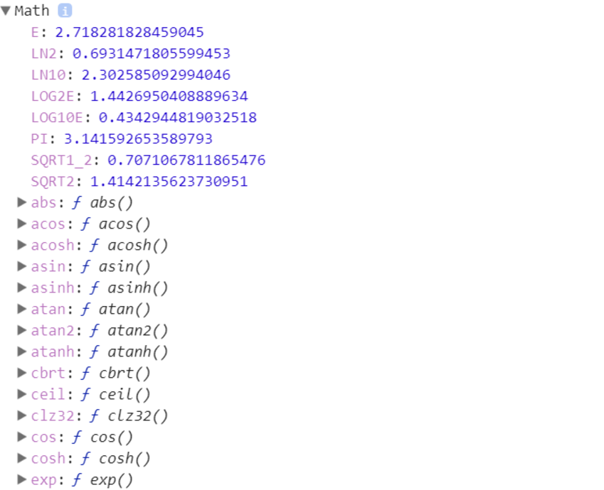
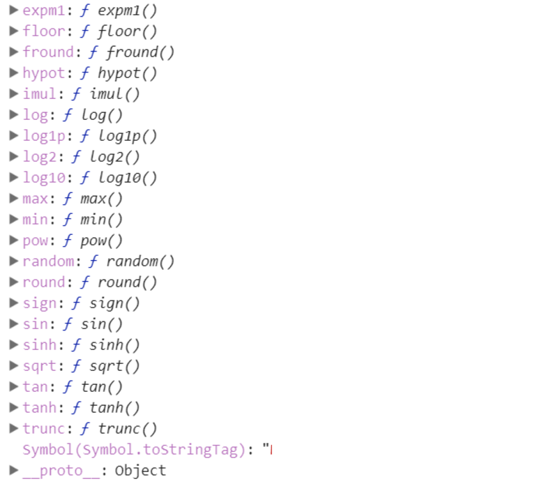
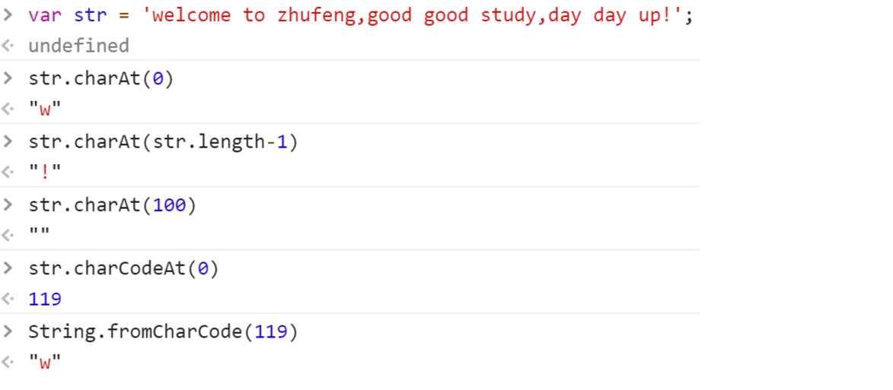
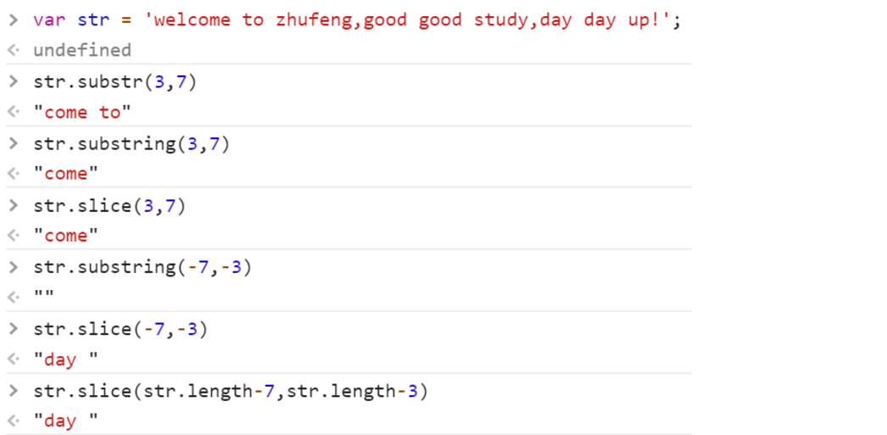
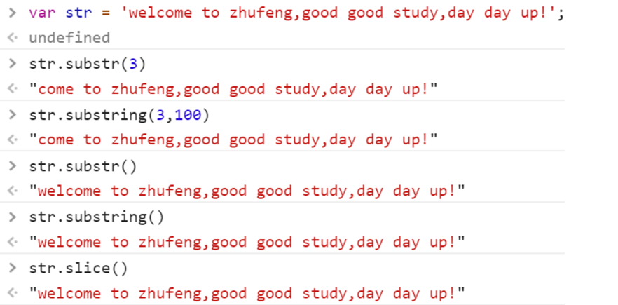
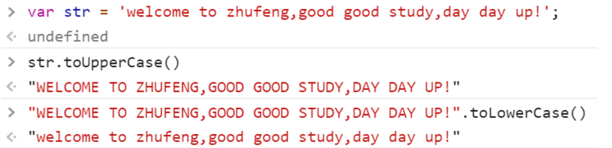
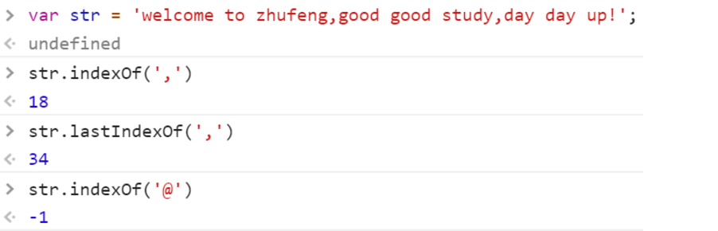

[TOC]
###2.JS免费课第二周第二天笔记
@(3.第二周笔记)

###一、Math中常用的方法
> 数学函数：它属于对象数据类型  `typeof Math ->'object'`
> Math对象中提供了很多操作数字的方法
> `console.dir(Math)`



####1.Math.abs 取绝对值
```javascript
Math.abs(12) ->12
Math.abs(-12) ->12
```
####2.Math.ceil 向上取整
```javascript
Math.ceil(12) ->12
Math.ceil(12.1) ->13
Math.ceil(12.9) ->13
Math.ceil(-12.1) ->-12
Math.ceil(-12.9) ->-12
```
####3. Math.floor 向下取整
```javascript
Math.floor(12) ->12
Math.floor(12.1) ->12
Math.floor(12.9) ->12
Math.floor(-12.1) ->-13
Math.floor(-12.9) ->-13
```
####4.Math.round 四舍五入
```javascript
Math.round(12.3) ->12
Math.round(12.5) ->13 正数中5包含在向上
Math.round(-12.3) ->-12
Math.round(-12.5) ->-12 负数中5包含在向下
Math.round(-12.51) ->-13
```
####5.Math.random 获取(0,1)之间的随机小数
```javascript
for(var i=0;i<100;i++){
	console.log(Math.random());
}
//=>需求：获取[0,10]之间的随机整数
Math.round(Math.random()*10)

//=>需求：获取[3,15]之间的随机整数
Math.round(Math.random()*12+3)

//=>获取[n,m]之间的随机整数
Math.round(Math.random()*(m-n)+n)
```
####6.Math.max 获取一组值中的最大值
```javascript
Math.max(12,23,14,24,34,25,13,15,16,27,13,12); ->34
```
####7.Math.min 获取一组值中的最小值
```javascript
Math.min(12,23,14,24,34,25,13,15,16,27,13,12); ->12
```
####8.Math.PI 获取圆周率（π）
```javascript
Math.PI ->3.141592653589793
```
####9.Math.pow 获取一个值的多少次幂 
```javascript
Math.pow(10,2) ->100
```
####10.Math.sqrt  开平方
```javascript
Math.sqrt(100) ->10
```
###二、字符串知识点梳理
####1.字符串及常用的方法
> - 在JS中用单(双)引号包裹起来的都是字符串；
> - 字符串就是由零到多个字符组成的,以数字作为索引，从零开始的；
> - 有一个叫做length的属性，存储的是当前字符串中字符的个数（字符串的长度）；
```javascript
var str = 'welcome to zhufeng,good good study,day day up!';
str[0] //->'w' 第一个字符
str.length //-> 字符串的长度:46
str[str.length-1] //->'!' 最后一个字符
str[100] //->undefined 如果指定的索引不存在获取的结果是undefined
```

> 真实项目中，我们经常操作字符串，此时我们需要掌握常用的一些字符串操作方法
> `console.dir(String.prototype)`
#####1.charAt && charCodeAt  &&  fromCharCode
> - ` str.charAt(索引)`：返回指定索引位置的字符，和str[索引]的区别在于，当指定的索引不存在的时候，中括号的方式获取的是undefined，而charAt获取的是空字符串；
>  
> - `str.charCodeAt(索引)`：在charAt基础上，把获取的字符变为unicode编码值（对应ASCII码表）；
> 48~57：0-9
> 65~90：A-Z
> 97~122：a-z
> ...
>  
> - `String.fromCharCode`(十进制的unicode值)：把值按照ASCII码表中的信息，转换为原有的字符，和charCodeAt正好对应；

#####2.substr && substring && slice
>  - 实现字符串截取的三个办法：
> `str.substr(n,m)`：从索引n开始，截取m个字符；
> `str.substring(n,m)`：从索引n开始，截取到索引为m处(不包含m)，把找到的部分截取；
> `str.slice(n,m)`：和substring语法一样，区别在于slice支持以负数做索引；
> 
> 
>  - 当`索引是负数`的时候，浏览器在处理的时候，是用`字符串的总长度加上负数索引`，然后按照正数处理操作；
>  
>  - 如果`只传递了n`（str.substr(n)/str.substring(n)），相当于从索引n开始一直`截取到字符串的末尾`；
>  
>  - 如果传递的`索引超出`最大限制，也是把`能截取的部分截取掉`即可；
>  
>  - 如果`一个参数都不传递`：相当于把整个字符串都截取（字符串的克隆）；


#####3.toUpperCase && toLowerCase
> str.toUpperCase ：把字母全部大写
> str.toLowerCase：把字母全局的小写

#####4.indexOf && lastIndexOf
> - str.indexOf：获取当前字符在字符串中第一次出现位置的索引；
> - str.lastIndexOf：获取的是最后一次出现位置的索引；
> - 如果当前字符在字符串中没有出现过，结果是-1；我们根据这个规律可以验证一下当前字符串中是否包含某个字符；
```javascript
if(str.indexOf('?')===-1){
	//=>没有出现过
}
if(str.indexOf('?')>=0){
	//=>出现过
}
```

#####5.split
> str.split：按照某一个字符把字符串拆分成数组中的某一项，和数组中的join方法是对应的；
```javascript
var hobbyList = 'music|movie|code';
hobbyList.split('|');
//=> ['music','movie','code']

var str = 'name=zhufeng&age=9';
str.split('=');
//=> ["name", "zhufeng&age", "9"]

var str = 'name=zhufeng&age=9';
str.split(/=|&/g);
//=> ["name", "zhufeng", "age", "9"]
```
#####6.replace
> - str.replace：实现字符的替换；
> - 执行一次replace只能替换一次，如果有好几个都需要替换，在不使用正则的情况下我们需要执行很多次replace；
> - 有些需求即使执行很多次replace也实现不了，此时需要使用正则处理，真实项目中replace一般都是和正则搭配使用的
```javascript
var str = 'zhufeng2017zhufeng2018';
str = str.replace('zhufeng','珠峰')
//=>'珠峰2017zhufeng2018';
str = str.replace('zhufeng','珠峰')
//=>'珠峰2017珠峰2018'

var str = 'zhufeng2017zhufeng2018';
str.replace(/zhufeng/g,'zhufengpeixun')
//=>'zhufengpeixun2017zhufengpeixun2018'
```
#####7.trim && trimLeft && trimRight
> `str.trimLeft`：去除字符串开始的空格
> `str.trimRight`：去除字符串结尾的空格
> `str.trim`：去除字符串首尾的空格
```javascript
var str='  zhu feng  ';
str.trimLeft(); //=> 'zhu feng  '
str.trimRight(); //=> '  zhu feng'
str.trim(); //=> 'zhu feng'
```
####2.实战应用 - 字符串之queryURLParameter
> 获取地址栏中URL地址问号传递的参数值
> https://www.baidu.com/s?wd=node&rsv_spt=1&issp=1
> https://www.baidu.com/s?wd=javascript&rsv_spt=1&issp=1
>  
> 目标：把问号传递的参数值分别的解析出来
> obj = {wd:'javascript',rsv_spt:1,issp:1}
```javascript
//=>方案一：
var questionIndex = str.indexOf('?');
str = str.substring(questionIndex + 1);
// console.log(str);//->'wd=javascript&rsv_spt=1&issp=1'
var ary = str.split('&');
// console.log(ary);//->["wd=javascript", "rsv_spt=1", "issp=1"]
var obj = {};
for (var i = 0; i < ary.length; i++) {
    var cur = ary[i];
    var curAry = cur.split('='),//->['wd','javascript']
        key = curAry[0],
        value = curAry[1];
    obj[key] = value;
}
console.log(obj);


//=>方案二：
function queryURLParameter(url) {
    //=>url:传递的参数(我们当前要解析的URL地址)
    var questionIndex = url.indexOf('?'),
        obj = {};
    if (questionIndex === -1) {//->url中没有问号传参:直接返回空对象
        return obj;
    }
    url = url.substr(questionIndex + 1);
    var ary = url.split('&');
    for (var i = 0; i < ary.length; i++) {
        var curAry = ary[i].split('=');
        obj[curAry[0]] = curAry[1];
    }
    return obj;
}
console.log(queryURLParameter('https://www.baidu.com/s?wd=javascript&rsv_spt=1&issp=1'));

//=>方案三：
String.prototype.myQueryURLParameter = function myQueryURLParameter() {
    var obj = {},
        reg = /([^=?&]+)=([^=?&]+)/g;
    this.replace(reg, function () {
        var arg = arguments;
        obj[arg[1]] = arg[2];
    });
    return obj;
};
var str = 'https://www.baidu.com/s?wd=javascript&rsv_spt=1&issp=1';
console.log(str.myQueryURLParameter());
```

####3.实战应用 - 验证码效果实现原理
> 真实项目中验证码一般都是后台处理的,后台返回给客户端展示的是一个图片(图片中包含了验证码)
 *   1、字母+数字
 *   2、问答
 *   3、12306 选择图片
 *   4、成语填空
 *   5、图片拼图
 *   6、滑动拖拽
 *  ....
```javascript
<div id="codeBox"></div>
```
#####1.验证码 - 基本功能实现
```javascript
var codeBox = document.getElementById('codeBox');
//=>生成四位随机验证码
var areaStr = '0123456789abcdefghijklmnopqrstuvwxyzABCDEFGHIJKLMNOPQRSTUVWXYZ';//->62位(0~61)
var result = '';
for (var i = 0; i < 4; i++) {
    //=>随机获取一个0~61之间的整数：作为接下来获取字符的索引
    var ran = Math.round(Math.random() * 61);

    //=>根据索引获取一个随机字符
    var char = areaStr.charAt(ran);

    //=>把每一次循环获取的字符存放在最后结果中
    result += char;
}
codeBox.innerHTML = result;
```
#####2.验证码 - 点击重新生成验证码
```javascript
var codeBox = document.getElementById('codeBox');
function queryCode() {
    var result = '',
        areaStr = '0123456789abcdefghijklmnopqrstuvwxyzABCDEFGHIJKLMNOPQRSTUVWXYZ';
    for (var i = 0; i < 4; i++) {
        var ran = Math.round(Math.random() * 61);
        result += areaStr[ran];
    }
    codeBox.innerHTML = result;
}
//=>加载页面需要执行一次这个方法:生成四位验证码
queryCode();
//=>点击盒子重新生成验证码(此处不加小括号：这块只是再把函数绑定给元素的点击事件，方法还没有执行，点击的时候才执行)
codeBox.onclick = queryCode;
```
#####3.验证码 - 四位不重复的验证码
```javascript
var codeBox = document.getElementById('codeBox');
function queryCode() {
    var result = '',
        areaStr = '0123456789abcdefghijklmnopqrstuvwxyzABCDEFGHIJKLMNOPQRSTUVWXYZ';
    for (var i = 0; i < 4; i++) {
        var ran = Math.round(Math.random() * 61),
            char = areaStr[ran];
        //=>验证一下新获取的CHAR字符是否已经在result中存在了,如果存在了我们不存储,重新在获取一遍,反之才累加到result中
        if (result.indexOf(char) > -1) {
            i--;
            continue;
        }
        result += char;
    }
    codeBox.innerHTML = result;
}
queryCode();
codeBox.onclick = queryCode;
```
#####4.验证码 - 大小写也算重复的问题
```javascript
var codeBox = document.getElementById('codeBox');
function queryCode() {
    var result = '',
        areaStr = '0123456789abcdefghijklmnopqrstuvwxyzABCDEFGHIJKLMNOPQRSTUVWXYZ';
    for (var i = 0; i < 4; i++) {
        var ran = Math.round(Math.random() * 61),
            char = areaStr[ran];
        //=>a和A也算重复，该如何处理?
        //result='Ab' 'ab'
        //char='a'    'a'
        //result.toLowerCase().indexOf(char.toLowerCase())===-1
        if (result.toLowerCase().indexOf(char.toLowerCase()) > -1) {
            i--;
            continue;
        }
        result += char;
    }
    codeBox.innerHTML = result;
}
queryCode();
codeBox.onclick = queryCode;
```

