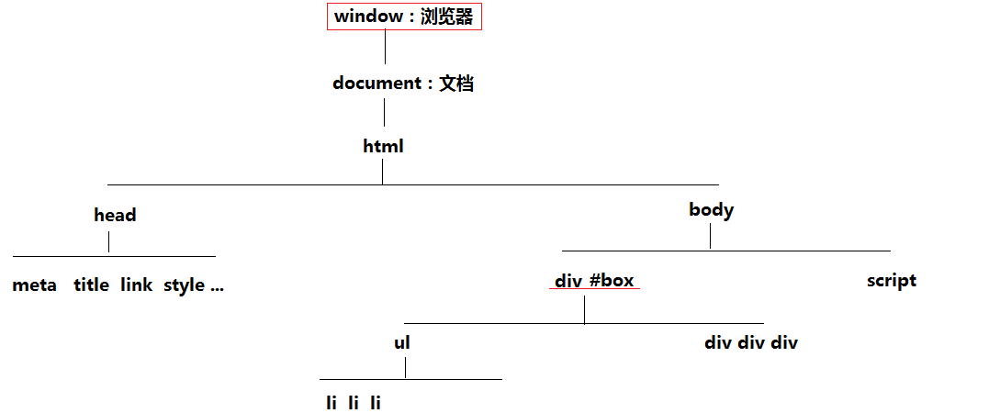

[TOC]
### 3.JS免费课第二周第三天笔记
#### 一、DOM基础精讲
@(3.第二周笔记)
> DOM：document object model 文档对象模型，提供一些属性和方法可以让我们去操作dom元素
#####1.获取DOM元素的方法
- document.getElementById 一个元素对象
- [context].getElementsByTagName 元素集合
- [context].getElementsByClassName 元素集合
- document.getElementsByName 节点集合
- document.documentElement 获取整个HTML对象
- document.body 获取整个body对象
- document.head 获取整个head对象
- [context].querySelector 一个元素对象
- [context].querySelectorAll 获取元素集合
- ...
######1.getElementById
> 此方法的上下文只能是document，一个HTML页面中元素的ID理论上是不能重复的
> - 如果页面中的ID重复了，我们获取的结果是第一个ID对应的元素对象
> - 在IE7及更低版本浏览器中，会把表单元素的name值当做id来识别使用（项目中尽量不要让表单的name和其它元素的id相同）
> - 如果我们把JS放在结构的下面，我们可以直接使用ID值来获取这个元素（不需要通过getElementById获取），而且这种方式会把页面中所有ID是他的元素都获取到（元素对象/元素集合）  （这种方式不推荐）

```javascript
//=>获取页面中ID值为#box1的所有元素标签
var allList = document.getElementsByTagName('*'),
    result = [];
for (var i = 0; i < allList.length; i++) {
    var item = allList[i];
    item.id === 'box1' ? result.push(item) : null;
}
console.log(result);
```
######2.getElementsByTagName
> - 上下文是可以自己来指定
> - 获取到的结果是一个元素集合（类数组集合）
获取的结果是集合，哪怕集合中只有一项，我们想要操作这一项（元素对象），需要先从集合中获取出来，然后再操作
> - 在指定的上下文中，获取所有子子孙孙元素中标签名叫做这个的(后代筛选)
```
<body>
   <div></div>
   <div></div>
   <div></div>
   ...
</body>
<script>
var bodyBox=document.getElementsByTagName('body');
bodyBox.getElementsByTagName('div');//->Uncaught TypeError: bodyBox.getElementsByTagName is not a function 此时的bodyBox是一个类数组集合，我们需要使用的是其中的第一项，而不是整个集合
bodyBox[0].getElementsByTagName('div')
</script>
```
######3.getElementsByClassName
> - 上下文也可以随意指定，获取的结果也是一个元素集合（类数组集合）
> - 真实项目中我们经常会通过样式类名来获取元素，getElementsByClassName这个方法在IE6~8浏览器中是不兼容的

######4.getElementsByName
> - 通过元素的NAME属性值获取一组元素（类数组：节点集合 NodeList）
> - 它的上下文也只能是document
> - IE浏览器只能识别表单元素的name属性值，所以我们这个方法一般都是用来操作表单元素的

######5.document.documentElement / document.body
> 获取html或者body（一个元素对象）
```javascript
document.documentElement.clientWidth||document.body.clientWidth //=>获取当前浏览器窗口可视区域的宽度（当前页面一屏幕的宽度）
document.documentElement.clientHeight||document.body.clientHeight//=>获取当前浏览器窗口可视区域的高度（当前页面一屏幕的高度）
```
######6.querySelector / querySelectorAll
> 在IE6~8下不兼容，而且也没什么特别好办法处理它的兼容，所以这两个方法一般多用于移动端开发使用
> `querySelector`：获取一个元素对象
> `querySelectorAll`：获取的是一个元素集合
> 只要是CSS支持的选择器，这里大部分都支持
#####2.DOM节点的分类
> node：节点，浏览器认为在一个HTML页面中的所有内容都是节点（包括标签、注释、文字文本等）
> - 元素节点：HTML标签
> - 文本节点：文字内容（高版本浏览器会把空格和换行也当做文本节点）
> - 注释节点：注释内容
> - document文档节点
> - ...
######1.元素节点
- nodeType：1
- nodeName：大写标签名(在部分浏览器的怪异模式下,我们写的标签名是小写,它获取的就是小写...)
- nodeValue：null
######2.文本节点
- nodeType：3
- nodeName：#text
- nodeValue：文本内容
######3.注释节点
- nodeType：8
- nodeName：#comment
- nodeValue：注释内容
######4.文档节点
- nodeType：9
- nodeName：#document
- nodeValue：null

#####3.DOM节点关系属性
> 节点是用来描述页面中每一部分之间关系的，只要我可以获取页面中的一个节点，那么我就可以通过相关的属性和方法获取页面中所有的节点；

######1.childNodes
> 获取当前元素所有的子节点（节点集合：类数组）
> 不仅仅是元素子节点，文本、注释等都会包含在内；子节点说明只是在儿子辈分中查找；

######2.children
> 获取所有的元素子节点（元素集合）
> 在IE6~8下获取的结果和标准浏览器中有区别（IE6~8中会把注释节点当做元素节点获取到）

######3.parentNode
> 获取当前元素的父节点（元素对象）

######4.previousSibling && nextSibling
> previousSibling：获取当前节点的上一个哥哥节点（不一定是元素节点也可能是文本或者注释）
> nextSibling：获取当前节点的下一个弟弟节点

######5.previousElementSibling &&  nextElementSibling
> previousElementSibling ：获取当前节点的上一个哥哥元素节点
> nextElementSibling：获取当前节点的下一个弟弟元素节点
> IE6~8下不兼容

######6.firstChild &&  lastChild
> firstChild：当前元素所有子节点中的第一个（也不一定是元素节点，可能是文本和注释）
> lastChild：当前元素所有子节点中的最后一个
######7.firstElementChild   &&  lastElementChild 
> 获取第一个元素子节点和最后一个元素子节点
> IE6~8不兼容
#####4.创建和增加 以及 修改删除克隆DOM元素
> 真实项目中，我们偶尔会在JS中动态创建一些HTML标签，然后把其增加到页面中
######1.document.createElement
> 在JS中动态创建一个HTML标签

######2.appendChild
> 容器.appendChild(新元素)
> 把当前创建的新元素添加到容器的末尾位置

######3.insertBefore
> 容器.insertBefore(新元素，老元素)
> 在当前容器中，把新创建的元素增加到老元素之前

######4.removeChild
> 容器.removeChild(元素)
> 在当前容器中把某一个元素移除掉

######5.replaceChild
> 容器.replaceChild(新元素,老元素)
> 在当前容器中，拿新元素替换老元素

######6.cloneNode
> 元素.cloneNode(false/true)
> 把原有的元素克隆一份一模一样的，false：只克隆当前元素本身，true：深度克隆，把当前元素本身以及元素的所有后代都进行克隆

######7.set/get/remove]Attribute
> 给当前元素设置/获取/移除 属性的（一般操作的都是它的自定义属性）
> box.setAttribute('myIndex',0)
> box.getAttribute('myIndex')
> box.removeAttribute('myIndex')
>  
> 使用xxx.index=0 和 xxx.setAttribute('index',0) 这两种设置自定义属性的区别？
> - xxx.index：是把当前操作的元素当做一个普通对象，为其设置一个属性名（和页面中的HTML标签没关系）；
> - xxx.setAttribute：把元素当做特殊的元素对象来处理，设置的自定义属性是和页面结构中的DOM元素映射在一起的；

JS中获取的元素对象，我们可以把它理解为两种角色：
- 与页面HTML结构无关的普通对象
- 与页面HTML结构存在映射关系的元素对象

> - 元素对象中的内置属性，大部分都和页面的标签存在映射关系：
> xxx.style.backgroundColor = 'xxx'  此时不仅把JS中对象对应的属性值改变了，而且也会映射到页面的HTML标签上（标签中有一个style行内样式、元素的样式改变了）
> 
> - xxx.className='xxx' 此时不仅是把JS对象中的属性值改了，而且页面中的标签增加了class样式类（可以看见的）
> 元素对象中的自定义属性：xxx.index=0 ；仅仅是把JS对象中增加了一个属性名（自定义的），和页面中的HTML没啥关系（在结构上看不见）
> - xxx.setAttribute：通过这种方式设置的自定义属性和之前提到的内置属性差不多，都是和HTML结构存在映射关系的（设置的自定义属性可以呈现在结构上）
#####5. 获取当前元素的上一个哥哥元素节点(兼容所有的浏览器)
```javascript
//=> 首先获取当前元素的上一个哥哥节点，判断当前获取的节点是否为元素节点（nodeType===1），如果不是，基于当前获取的节点，找他的上一个哥哥节点...(找几次不知道)一直到找到的节点是元素节点为止
//=> 如果在查找过程中，发现没有上一个哥哥节点了（找到头了），则不在继续查找
function prev(curEle) {
    var p = curEle.previousSibling;
    while (p && p.nodeType !== 1) {//->p:p!==null
        p = p.previousSibling;
    }
    return p;
}

//=>扩展：
//next：获取下一个弟弟元素节点
//prevAll：获取所有的哥哥元素节点
//nextAll：获取所有的弟弟元素节点
//siblings：获取所有的兄弟元素节点
//index：获取当前元素在兄弟中的排名索引
//...
```
###二、Date日期操作的基础知识
####1.Date的基础知识
> Date是日期类，通过它可以对时间进行处理
```javascript
var time = new Date();//=>获取当前客户端本机时间（当前获取的时间不能作为重要的参考依据）
//=>获取的结果是一个日期格式的对象：Sun Oct 22 2017 15:58:40 GMT+0800 (中国标准时间)
typeof new Date() ->'object'

time.getFullYear() //=>获取四位整数年
time.getMonth() //=>获取月（0~11代表1~12月）
time.getDate() //=>获取日
time.getDay() //=>获取星期（0~6代表周日~周六）
time.getHours() //=>获取小时
time.getMinutes() //=>获取分钟
time.getSeconds() //=>获取秒
time.getMilliseconds() //=>获取毫秒
time.getTime() //=>获取当前日期距离'1970-01-01 00:00:00'的毫秒差

var time = new Date('2017-10-22'); //=>当new Date中传递一个时间格式的字符串，相当于把这个字符串转换为标准的时间对象格式（转换完成后，就可以调取上面我们讲的那些方法了）
//=>时间格式的字符串
'2017-10-22'  (IE下识别不了)
'2017/10/22'
'2017/10/22 16:15:34'
1508659621314 (如果传递的是距离1970年的那个毫秒差，也是可以识别转换的，但是只能是数字，不能是字符串)
...

